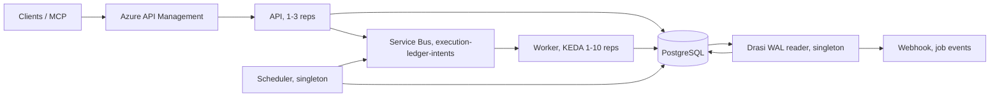
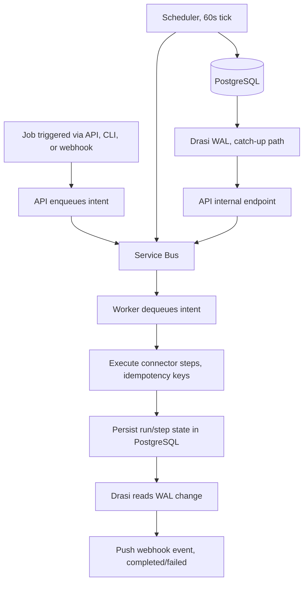

Execution Ledger is an open-source durable workflow orchestrator I built in Rust on Azure Container Apps. It handles step-level idempotency, targeted replay, and compensation for long-running jobs that span external systems. This post is about why I chose Rust, why I chose ACA, and what I learned along the way.

I’ve spent a lot of time around orchestration frameworks. Azure Durable Functions doesn’t automatically rewind entire orchestrations when a single step fails; instead, the orchestrator fails and previous steps remain executed, with "rewind" only available as a manual, preview‑level recovery that replays from the failure point. Temporal demands a Kubernetes cluster and a team comfortable with its programming model. And then there’s the dark matter: the cron scripts and PowerShell scheduled tasks that run half the back offices I’ve seen, failing silently at 3am until someone notices the queue depth.

<!-- truncate -->

I wanted something that treated recovery as a first-class capability rather than an operational afterthought. Something where an operator could replay _one step_ without touching the rest of the job. Something where compensation wasn't an afterthought but a first-class primitive. Something that ran on Azure's managed platform without requiring Kubernetes, and used managed identity everywhere because I am done explaining connection strings to auditors.

So I built Execution Ledger. It's a Rust multi-service backend deployed on Azure Container Apps, and this post is about why.

## The gap: step-level recovery as a first-class primitive

Most orchestration platforms treat replay as an all-or-nothing operation. Durable Functions rewinds the orchestration to a checkpoint, every step after that point re-executes. Temporal uses continue-as-new to re-run the entire workflow. Manual scripts? Hope your operator knows SQL.

The problem is that in real multi-step jobs, most step failures are surgical. The REST call to the ERP timed out because the ERP was under maintenance. The blob upload failed because a SAS token expired. Re-running every other step, steps that already committed, is wasteful at best and dangerous at worst.

Execution Ledger gives each connector step an idempotency key (derived from run ID + step ID) and lets you target replay at a specific step. Other steps in the run are untouched.

```bash
cargo run -p execution-ledger-cli -- job-replay <tenant-id> <run-id> health
```

That's it. One step. The worker re-executes only `health`. The other steps (the blob transfer, the queue message, the notification) stay exactly as they were. This makes incident recovery precise rather than all-or-nothing.

## Why Rust

Three reasons, in descending order of importance:

**1. No cold starts.** Container Apps scale from zero. When a Durable Functions app wakes up after inactivity, C# JIT compiles, JavaScript loads modules, Python imports libraries. Rust compiles to a native binary. Startup is measured in milliseconds, not seconds. When KEDA triggers a scale-out from 1 to 10 replicas because the Service Bus queue just spiked, every new replica starts processing intents immediately.

**2. Resource density.** A Rust binary serving HTTP with Axum at idle consumes single-digit megabytes of RAM. That matters in Container Apps where you pay per vCPU-second and per GB-second. At 10 worker replicas, the memory delta between Rust and a managed runtime pays for itself monthly.

**3. A compiler that actually enforces things.** The workspace denies `unwrap()`, `expect()`, and `panic!()` via clippy lints at the crate level. Unsafe code is forbidden. `clippy::pedantic` is set to warn. These aren't style preferences. They're guardrails. When you build a platform that processes tenant-scoped jobs with Entra-authenticated callers, you want the compiler catching mistakes before they reach production.

```rust
// ❌ won't compile — clippy::unwrap_used is deny
let config = load_config().unwrap();

// ✅ must handle the error path
let config = load_config().context("failed to load runtime config")?;
```

## The architecture

Execution Ledger runs as four Container Apps behind API Management:





The worker is the interesting piece. It uses a tokio semaphore for per-replica bounded concurrency (default 5 concurrent intents). KEDA monitors Service Bus queue depth and scales replicas. Combined, you get ~50 concurrent intent executions at the default ceiling, and you can scale higher with max replicas or the concurrency knob.

Steps within a single intent execute sequentially. This is by design: step 3 might need the file path step 2 produced. Cross-run parallelism comes from horizontal scaling via replicas.

## Why Azure Container Apps

I evaluated three deployment targets:

|                  | Container Apps            | AKS (Standard)                     | Azure Functions                   |
| ---------------- | ------------------------- | ---------------------------------- | --------------------------------- |
| Rust support     | Docker container (native) | Docker container (native)          | Custom handler only               |
| KEDA integration | Built-in                  | Manual install                     | Built-in (but C#/JS/Python only)  |
| Managed identity | Built-in                  | Workload identity via pod identity | Built-in                          |
| Cold start       | Fast (native binary)      | Fast (native binary)               | Can't run Rust functions natively |
| Ops burden       | Near zero                 | Persistent                         | Near zero                         |

Container Apps won because KEDA scale rules, managed identity, and private networking come out of the box. The `azd` integration (`azure.yaml` at the repo root) means the entire infrastructure (Service Bus, PostgreSQL Flexible Server, Key Vault, App Configuration, APIM, four Container Apps, private DNS zones, Log Analytics) provisions with one command:

```bash
azd provision && azd deploy
```

The [Drasi](https://drasi.io/) service runs as a singleton because PostgreSQL logical replication slots are inherently single-consumer. The scheduler runs as a singleton because it only enqueues intents; worker replicas do the real work. Both are Container Apps with `maxReplicas: 1` in the Bicep template, not special infrastructure.

## Why not Durable Functions?

Execution Ledger isn't trying to replace Azure Durable Functions.

Durable Functions is excellent for event-driven serverless workflows where the orchestration model fits your problem.

Execution Ledger solves a different problem: operational recovery. Every connector step is independently replayable, idempotent, and compensatable. Instead of restarting an orchestration from a checkpoint, operators can replay exactly the failed step while preserving the rest of the execution history.

## What I learned

**KEDA on Service Bus works beautifully for Rust workloads.** Each replica competes for messages via `ServiceBusReceiverClient`. No coordination needed. The queue depth threshold of 25 messages per replica provides predictable scaling without flapping.

**PostgreSQL connection pool sizing deserves its own section of the README.** With N worker replicas each opening a pool, you hit `max_connections` faster than you think. Azure PostgreSQL Flexible Server B1ms caps at 97 connections. With 10 workers at a steady-state ~7 connections each + 3 API + 1 scheduler + 1 Drasi = 75. Leave headroom.

**App Configuration with Key Vault references is the right config pattern.** Bootstrap env vars carry only the App Configuration endpoint and environment label. Everything else (queue names, timeouts, toggles) lives in App Configuration by label. Key Vault references (`<secret:my-secret>`) resolve at startup via managed identity. The process fails closed if any required secret is missing. No connection strings. No access keys. No shared secrets in env vars.

**The doc-comment-as-specification pattern works for Rust connector code.** Every connector module has a `//!` header explaining its configuration contract, fail-closed behaviour, and compensation model. Here's the `rest` connector header:

```rust
//! REST and ERP connectors.
//!
//! | Key | Source | Required | Default | Notes |
//! |-----|--------|----------|---------|-------|
//! | `url` | config or input | yes | — | Target URL |
//! | `method` | config or input | no | `POST` | HTTP method |
//! | `timeoutMs` | config or input | no | `30000` | Clamped to 120s max |
//! | `headers` | config | no | — | Custom headers (some denylisted) |
//!
//! ## Fail-closed behavior
//! - Returns `InvalidConfiguration` if `url` is missing.
//! - Returns `InvalidConfiguration` if any denylisted header is present.
//! - Returns `DependencyFailed` if the HTTP request fails.
```

This doubles as documentation and as a specification for anyone adding a new connector.

## Is this for you?

Execution Ledger fits when you need durable, auditable job orchestration with built-in recovery controls. It's not for serverless event-driven workflows (use Durable Functions) or complex long-running workflows with custom activity patterns (use Temporal). It's for teams running ERP integrations, queue-based processing, blob transfers, or REST orchestration that need to survive failures without manual intervention, and who want the platform to prove it can recover before the first 3am page.

:::info
The repo is open source at [github.com/lukemurraynz/Execution-Ledger](https://github.com/lukemurraynz/Execution-Ledger). Dual-licensed Apache 2.0 / MIT. Contributions welcome.
**Try it in 5 minutes:** Clone the repo, open in VS Code, choose Reopen in Container. The devcontainer provisions a local Postgres with everything pre-wired. Then `cargo run -p execution-ledger-cli -- db-status` and you're off.
:::

## References

- [Execution Ledger on GitHub](https://github.com/lukemurraynz/Execution-Ledger)
- [Azure Container Apps documentation](https://learn.microsoft.com/azure/container-apps/?WT.mc_id=AZ-MVP-5004796)
- [KEDA scalers for Azure](https://learn.microsoft.com/azure/container-apps/scale-app/?WT.mc_id=AZ-MVP-5004796)
- [Azure PostgreSQL Flexible Server](https://learn.microsoft.com/azure/postgresql/flexible-server/?WT.mc_id=AZ-MVP-5004796)

