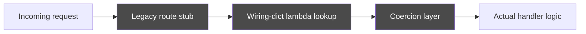

Every codebase that has lasted long enough builds up at least one layer like this. Request stubs call into a wiring dict: a lookup table of small lambda functions, one per route, that exists only to find the right handler. Those lambdas call translation functions that move data between an old dispatch shape and what the framework now wants on its own. It worked when it was written. Every new feature since has paid a cost: it goes through three extra steps to do something the framework could do directly if you let it.

<!-- truncate -->

## The shape of the problem

Three extra steps sit between "a request arrived" and "code that does something with it." None of the three add behaviour. All three exist because, at some point, the framework's built-in routing did not do what the app needed yet. That was the fastest way to bridge the gap. Years later, the framework has caught up. But hundreds of routes still depend on that bridge, and nobody wants to be the one who breaks it.

"Just rewrite it" is the answer everyone reaches for. It is also the answer almost nobody can actually ship. A rewrite means a feature freeze long enough to matter. It also means one huge merge that is almost impossible to review well. And it creates a regression surface that spans the entire app instead of one corner of it. The option that actually ships is one domain at a time.

That option already has a name, so use it instead of acting like it is new. Martin Fowler wrote about it on martinfowler.com in 2004 as the [strangler fig application](https://martinfowler.com/bliki/StranglerFigApplication.html). The name comes from the way a strangler fig seed grows high in a host tree's branches. Over years, it sends roots down around the trunk until the original tree is no longer holding anything up. Build the new path next to the old one. Move traffic to it one piece at a time. Retire the old piece as nothing depends on it anymore. The general shape is Fowler's. What is specific to a legacy HTTP dispatch layer is the fixed rule set below. It shows what a strangler fig migration looks like when the thing you are strangling is three layers of route-dispatch extra steps in front of hundreds of endpoints.

## The migration rules

1. **Freeze the current list of routes as a baseline before changing anything:** add a test that checks the current set of registered routes. Then any drop or duplicate during migration fails loudly instead of shipping silently. This one test is what makes everything after it safe. You cannot check "nothing changed for the caller" without first writing down what "unchanged" means.
2. **Move one domain's handlers to the framework's built-in pattern for each pass.** Not the whole app. Pick one clear slice, such as a single API domain (orders, billing, or whatever your app's real seams are). Replace it with native routers and typed request and response schemas. Share one dependency-injection context instead of spreading ad hoc lookups through the handler.
3. **Port the old tests to the new transport, don't write them from scratch.** The current test suite shows the real behaviour, edge cases and all. Those cases often came from real incidents. Writing tests from a blank page means finding those edge cases the hard way, in production, again. Porting a dispatch-based test to hit the new HTTP layer directly keeps the same contract while changing the mechanism underneath it. Keep the same inputs and the same status codes and payloads. Only the transport changes.
4. **Delete the old domain's legacy modules as soon as the cutover is done.** Not "leave them for now in case we need to roll back." The moment the new path is checked and merged, remove the old wiring for that domain in the same change. Two ways to do the same thing are worse than either way alone. A bug fix now has to be made in both places, or it silently does not.

## Where the actual time goes

The router code itself is close to mechanical. The time sink is everywhere the old and new paths disagree about details nobody wrote down:

- **Status code mapping:** the old dispatch shim might turn a permission error into a 403 and a value error into a 400 through some central error handler. The new built-in router needs the same mapping. If it does not, clients that depend on specific status codes break. That can be easy to miss in a quick manual check and obvious the moment a real client hits it.
- **Test harness behaviour that hides real errors:** a test client that swallows server exceptions by default can report a clean pass on a handler that is actually throwing a 500. The framework caught the exception before your assertion ever saw the status code. Get this wrong and "port the tests" from rule 3 quietly stops testing anything.
- **Request shape differences:** a GET that used to pass parameters through a dispatch-layer body now needs those parameters in the query string to fit the framework more cleanly. Each difference is small. There are a lot of them.

A design doc never catches this. A failing test does, one at a time. That is why a domain-by-domain migration matters. A failing test in a 30-route migration tells you something specific. A failing test in a 400-route one huge rewrite tells you almost nothing about where to look.

## What this rule set adds to the general pattern

The general case for a strangler fig migration over a rewrite is well known: ship value steadily, avoid a feature freeze, and catch regressions in a scope small enough to debug. What this rule set adds for a dispatch-layer migration is specific. The baseline from rule 1 turns each migration into a change you can check with a test, not just a smaller one. You are not asking a reviewer to trust that "the behaviour is the same." You are pointing to a test that proves it. That test fails the build the moment parity breaks. This scales in a way careful review never does, and it misses nothing the test actually covers.

None of this is tied to one framework. None of it requires treating the strangler fig approach as a new idea. It is the discipline that makes "boring, steady, and safe" beat "fast, exciting, and scary" when the thing you are strangling is a dispatch layer that hundreds of routes depend on.
