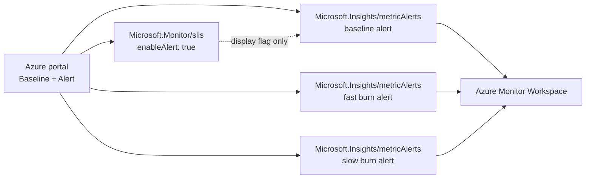
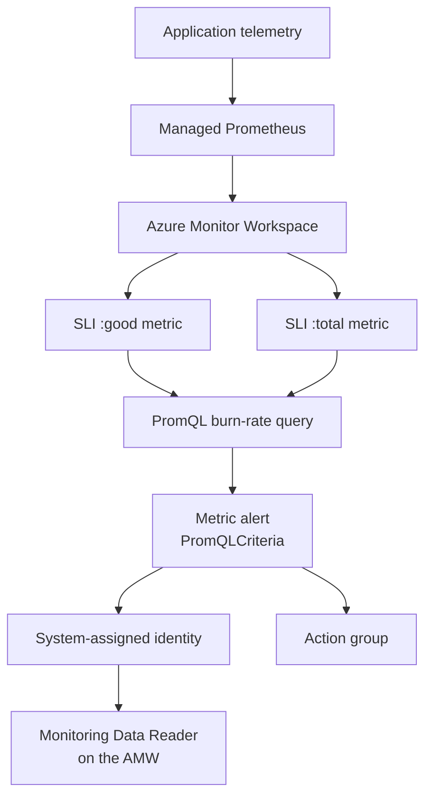

I spent the better part of a day convinced that [Azure Monitor SLI](https://learn.microsoft.com/azure/azure-monitor/fundamentals/service-level-indicators-create?WT.mc_id=AZ-MVP-5004796) alerting could not be deployed as infrastructure as code. I wrote a parallel implementation to work around it. 

I was wrong, and the way I was wrong is the useful part.

<!-- truncate -->

## The trap

You create an SLI on a service group, and you want it to alert. So you read the API. `Microsoft.Monitor/slis` at `2025-03-01-preview` gives you exactly one alerting property:

```jsonc
"enableAlert": true
```

That is the whole surface. No threshold, no lookback window, no severity, and no action group. I checked the TypeSpec in [`azure-rest-api-specs`](https://github.com/Azure/azure-rest-api-specs), all seven files. I checked every API version the resource provider reports. There is only one. I checked whether a newer version existed. It does not.

Then I set `enableAlert: true` on a badly breaching SLI, with attainment at 79.9% against a 99% target and the error budget long since exhausted, and waited. No alert appeared in Alerts Management after fifteen minutes.

I was starting to think that the feature was portal-only and could not be expressed as code, which was weird as the portal is essentially an ARM (Azure Resource Manager) client. That conclusion was wrong.

## What the portal actually does

The portal's Baseline + Alert tab offers fast burn rate, slow burn rate, and action group selection. Since the SLI API has none of those fields, I captured what the portal sends when you select Save.

It updates the SLI, at the same API version I was already using, but only to flip `enableAlert`. Then it creates three ordinary `Microsoft.Insights/metricAlerts` resources in the workload resource group:

```text
<sliName> baseline alert
<sliName> fast burn alert
<sliName> slow burn alert
```

Those resources use `api-version=2024-03-01-preview`, with `odata.type: Microsoft.Azure.Monitor.PromQLCriteria`. They scope the query to the Azure Monitor Workspace (`targetResourceType: microsoft.monitor/accounts`), not to the SLI.



`enableAlert` is a display flag. The alerts are the mechanism, and they are entirely ordinary ARM resources. Nothing private is involved. The undocumented part is the relationship between the two resource types.

## The queries

The alerts read the SLI's own emitted metrics. The SLI lists them under `destinationMetrics` as `<sli>:Good`, `<sli>:Total`, and `<sli>:Value`.

For a request-based SLI, the baseline rule checks attainment against the target:

```promql
(
  sum without ("INCLUDE-ALL-DIMENSIONS-DONT-REMOVE") ({"availability:good"})
  /
  sum without ("INCLUDE-ALL-DIMENSIONS-DONT-REMOVE") ({"availability:total"})
) * 100 < 99
```

The burn-rate rule divides the observed error ratio by the error budget:

```promql
(
  (
    sum without ("INCLUDE-ALL-DIMENSIONS-DONT-REMOVE") (increase({"availability:total"}[15m]))
    -
    sum without ("INCLUDE-ALL-DIMENSIONS-DONT-REMOVE") (increase({"availability:good"}[15m]))
  )
  /
  (
    sum without ("INCLUDE-ALL-DIMENSIONS-DONT-REMOVE") (increase({"availability:total"}[15m])) * (1 - 0.99)
  )
) > 14
```

Two details are easy to get wrong.

First, the correct function is `increase()`, not `sum_over_time()`. This corrects what I originally put in the post. The SLI publishes `:good` and `:total` as cumulative totals over the compliance window. They are not counters in the reset-on-restart sense, but they are monotonically increasing.

Early on, `rate()` against a freshly created SLI returned an empty result. I concluded from that single data point that the series was incompatible with the rate family of PromQL functions. It was not. The likely cause was too few samples. Rate-family functions need at least two samples spanning enough of the window to extrapolate from, and a new SLI cannot provide that.

After the series had been running for hours, `rate()` and `increase()` returned normal, consistent values. `sum_over_time(x[15m])` sums fifteen cumulative snapshots of an ever-growing total. That gives you a lookback-averaged cumulative ratio, not the error rate during those fifteen minutes.

Measured live, a total outage held burn rate at about 3.5 against a 14x threshold for more than five minutes. A fault confined to one SLI partition took 49 minutes to cross the same threshold. With `increase()`, the replay crossed at T+5 minutes, and a fresh live fault fired the alert at 10m06s end to end. That includes the mandatory `for: PT5M` sustained-condition window after the metric crossed the threshold.

If a PromQL function returns an empty result, that means the query has insufficient data at that point. It does not mean the data shape is incompatible. Retest after the series has real volume.

Second, `sum without ("INCLUDE-ALL-DIMENSIONS-DONT-REMOVE")` is deliberate. The label does not exist, so the aggregation removes no real dimensions. A partitioned SLI still alerts per partition. It is the portal's own idiom, and copying it avoids changing the alert's scope accidentally.

The metric names also need quoted-selector syntax: `{"availability:good"}` rather than a bare identifier, because the names contain `:` and `-`.

## `Burnrate` exists, but is not published

Partway through the investigation I found `Burnrate` declared as a first-class sampling type in `kqlmQueryResult.tsp`, alongside `Good`, `Total`, `Uptime`, `Downtime`, and `Value`. That looked like the answer. The service computes burn rate itself, so surely there must be a metric to alert on.

There is not.

`kqlmQueryResult.tsp` describes the SLI query result model, not the metric contract. The live workspace publishes `:good`, `:total`, and `:value` for request-based SLIs, plus `:uptime`, `:downtime`, and `:value` for window-based SLIs. It does not publish `:burnrate`. Even with `enableAlert: true`, `destinationMetrics` lists only Good, Total, and Value.

The service computes burn rate internally and exposes it through its query surface, but does not publish it as a metric that an alert can read. The alert rules therefore calculate burn rate from `:good` and `:total`.

## Four errors between here and a working deployment

Each of these took a deployment cycle to find.

`The template language function 'mul' expects its first parameter to be of type 'Integer'.`

I was calculating the baseline threshold as `json(sloTarget) * 100` to turn `0.99` into `99`. ARM's `mul` is integer-only. Carry the percentage as its own parameter.

`Query-based alert rule doesn't support 'global' location.`

Classic metric alerts are global resources, so every example you have copied probably sets `location: 'global'`. A PromQL-based alert is regional. Set `location` to the workload's region.

`Query-based metric alert rules need a managed identity. Make sure it's configured.`

Add `identity: { type: 'SystemAssigned' }`.

Then, silently, nothing evaluates. That identity needs Monitoring Data Reader (`b0d8363b-8ddd-447d-831f-62ca05bff136`) on the Azure Monitor Workspace it queries. The rule deploys cleanly without the role assignment.

:::danger
The managed identity and its Monitoring Data Reader role are part of the alert's working configuration. A successful ARM deployment does not prove that the query can evaluate.
:::

## The Bicep

This is the important part of the resource. The full implementation is in [`infra/modules/sli-native-alerts.bicep`](https://github.com/lukemurraynz/AzureSLI-AzureSREAgent/blob/main/infra/modules/sli-native-alerts.bicep).

```bicep
resource fastBurnAlert 'Microsoft.Insights/metricAlerts@2024-03-01-preview' = {
  name: '${sliName} fast burn alert'
  location: location          // NOT 'global'
  identity: {
    type: 'SystemAssigned'    // required, and needs Monitoring Data Reader on the AMW
  }
  properties: {
    enabled: true
    severity: 1
    targetResourceType: 'microsoft.monitor/accounts'
    scopes: [ azureMonitorWorkspaceResourceId ]
    evaluationFrequency: 'PT1M'
    criteria: {
      'odata.type': 'Microsoft.Azure.Monitor.PromQLCriteria'
      allOf: [
        {
          name: 'SliAlertCriterion'
          query: burnRateQuery
          criterionType: 'StaticThresholdCriterion'
        }
      ]
      failingPeriods: { for: 'PT5M' }
    }
    actions: [ { actionGroupId: pageActionGroupResourceId } ]
    customProperties: {
      serviceGroupId: '/providers/Microsoft.Management/serviceGroups/<sg>'
      sliId: '/providers/Microsoft.Management/serviceGroups/<sg>/providers/Microsoft.Monitor/slis/${sliName}'
      alertKind: 'fast-burn-rate'
      burnRate: '14'
      lookback: '15m'
    }
  }
}
```

`customProperties` is not decoration. The portal uses that shape to reconstruct its Baseline + Alert UI from the alert resources. If you want alerts deployed from Bicep to render correctly in the SLI blade, reproduce the shape.

The complete relationship looks like this:



## Why the native path matters

Because I believed SLI alerting was not IaC-able, I built multi-window burn-rate alerting myself in `Microsoft.AlertsManagement/prometheusRuleGroups`, recomputing the error ratio from raw application counters.

That parallel implementation drifted in the dangerous direction.

My PromQL summed across all three service tiers, so one user request counted once per hop and inflated the denominator roughly threefold. It also left `/healthz` and `/readyz` in the denominator, even though those endpoints never fail. Both errors pushed the ratio down, making the alert less sensitive than the SLO it was meant to enforce.

Neither object looked wrong in isolation. The SLI was correct. The alert rule was syntactically valid and fired in testing, because the test fault was a total outage and a total outage trips almost anything. I found the problem by measuring detection latency before and after correcting the selectors. The same outage went from 9m47s to 5m20s.

Alerts derived from the SLI's own published output cannot drift from the SLO they enforce. There is no second implementation to disagree with. That is a stronger property than saving a few lines of Bicep.

## What I'd tell Microsoft

The capability is good. The burn-rate formula is right, the multi-window design is right, and the portal experience is clean.

The gap is that nothing points from the SLI resource to the alert resources. The `enableAlert` boolean actively misleads: it looks like the alerting switch, and setting it does nothing observable by itself.

A line in the SLI documentation saying that alert configuration is stored as `Microsoft.Insights/metricAlerts` resources with `PromQLCriteria` would have saved me a day and a wrong-headed workaround. The four deployment requirements would also make a useful quickstart:

* ARM `mul` expects an integer
* PromQL metric alerts need the workload's regional location
* PromQL metric alerts need a managed identity
* That identity needs Monitoring Data Reader on the workspace

## The lesson I'd keep

I read the spec, tested the one field it exposed, and concluded that a feature did not exist. The spec was accurate. My inference from it was not.

When a portal can do something an API apparently cannot, the portal is still an ARM client. Twenty seconds in the network tab would have told me what a day of reading TypeSpec did not.

Check what the product does before concluding what it cannot.

The full Bicep for this alerting layer, and the rest of the showcase it belongs to, is public in [lukemurraynz/AzureSLI-AzureSREAgent](https://github.com/lukemurraynz/AzureSLI-AzureSREAgent).

Hopefully this article saves you the day I spent looking in the wrong resource type.

## References

* [AzureSLI-AzureSREAgent repository](https://github.com/lukemurraynz/AzureSLI-AzureSREAgent)
* [Native SLI alert implementation](https://github.com/lukemurraynz/AzureSLI-AzureSREAgent/blob/main/infra/modules/sli-native-alerts.bicep)
* [AzureSLI-AzureSREAgent architecture and reliability chain](https://github.com/lukemurraynz/AzureSLI-AzureSREAgent#architecture)
* [AzureSLI-AzureSREAgent deployment and demo runbook](https://github.com/lukemurraynz/AzureSLI-AzureSREAgent/blob/main/docs/demo-runbook.md)
* [Why SLOs are not just alerts](https://github.com/lukemurraynz/AzureSLI-AzureSREAgent/blob/main/docs/why-slos-not-just-alerts.md)