Most Kubernetes monitoring tells you a pod restarted. Almost none of it tells you whether that mattered to anyone.

I wanted to see whether an [Azure Monitor SLI](https://learn.microsoft.com/azure/azure-monitor/fundamentals/service-level-indicators-create?WT.mc_id=AZ-MVP-5004796) could give the [Azure SRE Agent](https://learn.microsoft.com/azure/sre-agent/overview?tabs=task&WT.mc_id=AZ-MVP-5004796) enough context to investigate a [Azure Kubernetes Services](https://learn.microsoft.com/azure/aks/what-is-aks?WT.mc_id=AZ-MVP-5004796) failure, rather than just react to a pod alert. So I built a small payment service, measured it through [Service Group](https://learn.microsoft.com/azure/governance/service-groups/overview?WT.mc_id=AZ-MVP-5004796) scoped SLIs, and deliberately broke it.

The result is an infrastructure-as-code deployment that runs with `azd up`: SLIs measure availability, latency, the full request journey, the public path, and customer tiers; Azure Monitor alerts on the SLI output; and the Azure SRE Agent investigates the incident and, when allowed, fixes it. The guardrails section leans on `kubectl` and Kubernetes audit logs because that is where the useful evidence turned up.

I got several things wrong. The corrections stay in the post because they are the parts you might otherwise have to rediscover.

<!-- truncate -->

:::info
> Before getting into the build, three terms need separating. An **SLI (Service Level Indicator)** is the measured number, such as "99.2% of checkout requests succeeded in the last 24 hours." An **SLO (Service Level Objective)** is the internal target for that number, such as "availability stays above 99% over a rolling 28 days." An **SLA (Service Level Agreement)** is the contractual promise to a customer, and should be looser than the SLO.
Most teams have an SLA somewhere in a contract, an SLO nobody agreed on, and an SLI that's really just "whatever our dashboard happens to show."
Azure SRE Agent is Microsoft's AI agent product for exactly this problem: it watches Azure Monitor alerts, investigates using your actual logs and metrics, and, if configured to do so, takes a remediation action itself and looks for root cause if it has access to the codebase. No human has to be paged, triage the graphs, and type `kubectl scale` at 3am. The agent does the first pass, and depending on how much you trust it for a given incident class, either proposes what it would do or does it.
The outcome I wanted was an SLO breach that names which customer segment is affected, a differentiated SLA expressed in Azure Monitor, and an AI agent that checks the other firing SLIs before it touches a workload. 
:::

## What I built

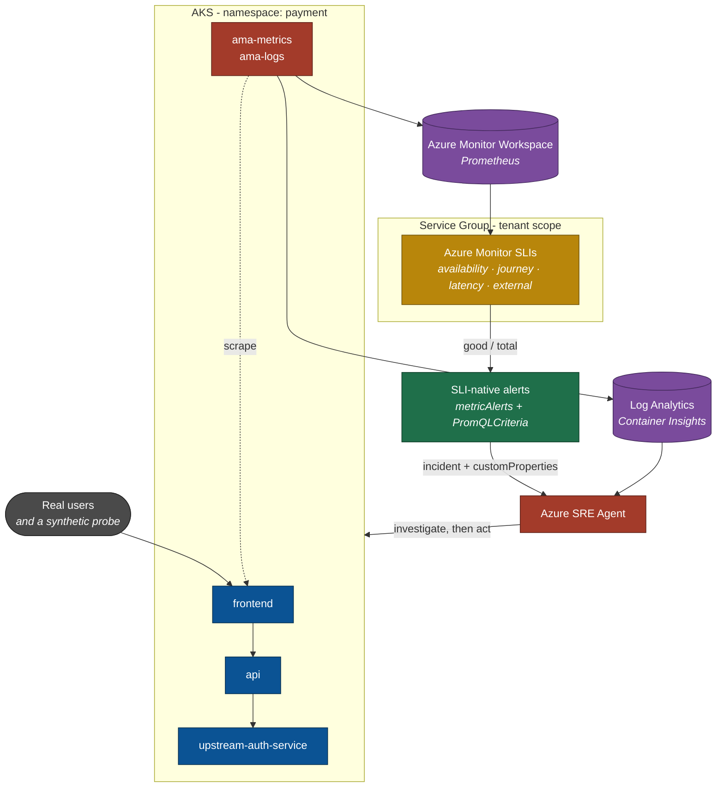

The arrow from `slis` to `alerts` is the part I cared about. The alerts read the SLI's own published metrics, not the raw application counters. That keeps the alert and the SLO measuring the same thing.

:::info
The repository, including the Bicep, fault-injection scripts, and agent configuration, is public: [lukemurraynz/AzureSLI-AzureSREAgent](https://github.com/lukemurraynz/AzureSLI-AzureSREAgent).
:::

## Service Groups keep the SLO above the cluster

An SLI in Azure Monitor is an extension resource on a tenant-scoped Service Group:

```text
/providers/Microsoft.Management/serviceGroups/<sg>/providers/Microsoft.Monitor/slis/<name>
```

That scope is the point. A service is rarely one resource group: frontend here, API there, a database in a shared subscription. A tenant-scoped Service Group gives the service an identity that outlives any particular resource layout, and the SLO hangs off the service rather than off a cluster.

The Service Group does not define what the SLI measures. There is no membership involved. An SLI's scope is `sourceAmwAccountResourceId` plus a metric name and dimension filters:

```jsonc
"filters": [
  { "dimensionName": "namespace",   "operator": "eq",            "value": "payment" },
  { "dimensionName": "service",     "operator": "eq",            "value": "frontend" },
  { "dimensionName": "path",        "operator": "eq",            "value": "/checkout" },
  { "dimensionName": "status_code", "operator": "notstartswith", "value": "5" }
]
```

The Service Group is the SLO's home, not its definition. Membership gives you topology and rollup, but changes nothing about what any SLI computes.

Membership is ordinary Bicep, with one sharp edge. `2026-03-01-preview` returned `RelLifecycleNotEnabledForTenant`; the older `2023-09-01-preview` worked:

```bicep
targetScope = 'subscription'

resource serviceGroupMembership 'Microsoft.Relationships/serviceGroupMember@2023-09-01-preview' = {
  name: 'slisreShowcaseBicep' // alphanumeric only, 3-64 chars
  properties: {
    targetId: '/providers/Microsoft.Management/serviceGroups/${serviceGroupId}'
  }
}
```

The relationship's parent is the member, not the Service Group, so this is subscription-scoped. The SLIs are the opposite case: their parent is the Service Group, which forces a tenant-scoped deployment and an Azure RBAC grant at `/` that Global Administrator does not confer.

You can express "one SLO across frontend, API and auth" today with one multi-value filter:

```jsonc
{ "dimensionName": "service", "operator": "in", "value": "frontend^^api^^upstream-auth-service" }
```

`in` and `notin` take a `^^`-delimited string, not a JSON array. That's documented in one TypeSpec comment and nowhere else.

## The SLI definitions

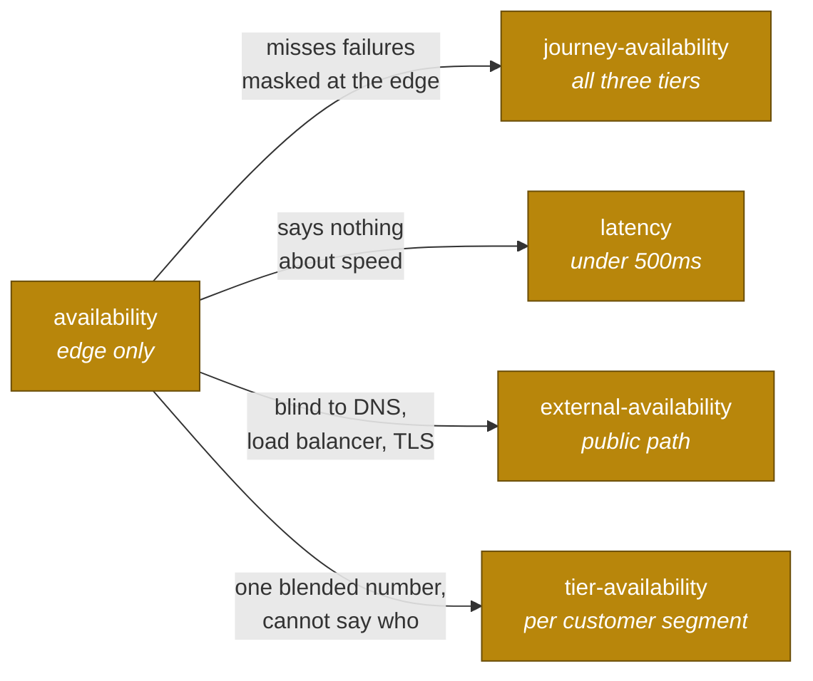

Each exists because the basic availability number leaves something out. A sixth, `latency-windowed`, measures the same 500ms bar as mean latency per five-minute window rather than per request, and is covered separately below.

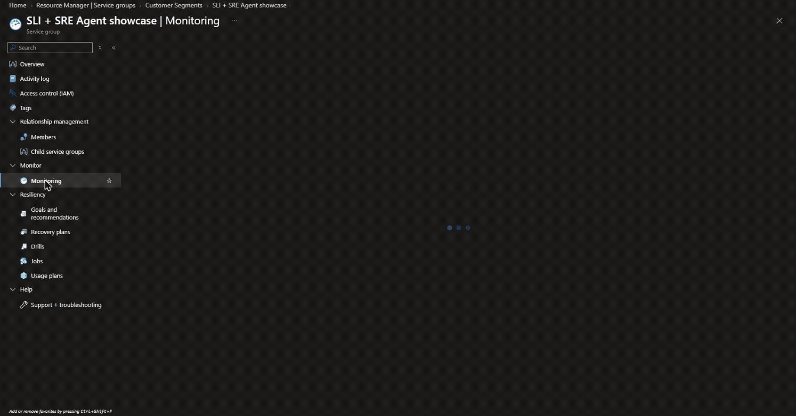

`availability` measures the edge at `/checkout`: good requests over total. `journey-availability` spans all three tiers with the `in` filter. An edge-only SLI stays green when the API fails and the frontend serves a cached fallback, while the user's journey is broken.

`latency` exists because a service that answers every request in nine seconds is up, and useless. Good is the `le="0.5"` histogram bucket; total is the request count.

`external-availability` matters because every SLI above is computed from traffic generated inside the cluster. You cannot measure an outage from inside the thing that is unreachable. If DNS breaks or the load balancer misroutes, no request arrives, so there is no error metric and no denominator either. Availability reads 100% during a total outage. That is structural; it needs something outside the workload requesting the service over the real network path.

`tier-availability` is the same measurement as `availability`, partitioned by who the customer is rather than by which component served them.

For any SLO, ask which signal moves if DNS breaks. If none does, it measures instrumentation rather than availability.

## The signal and the dimensions

The demo app is instrumented with the Prometheus client because I wrote it. Most workloads you need SLOs for are not yours to change, and that's fine: the SLI reads Prometheus series from an Azure Monitor Workspace and does not care what produced them.

| Source | App change | Gives you |
| --- | --- | --- |
| Ingress controller metrics | None | `nginx_ingress_controller_requests{service,status}` |
| Service mesh sidecar | None | Per-hop RED metrics |
| `blackbox_exporter` | None | `probe_success` and certificate-expiry alerting |
| OTel auto-instrumentation | None (agent) | In-process HTTP metrics |
| App instrumentation | Yes | Whatever you choose |

Prefer an infrastructure-emitted signal even when you can instrument the app. It survives redeploys, language changes and vendor upgrades, and is uniform across every service behind it.

One trap cost me hours: for Managed Prometheus sources, `metricNamespace` must be `customdefault`, not `prometheus`. With the wrong value the metric resolves fine and SLI creation fails with errors about dimensions, which is entirely the wrong place to look.

### Measuring users, not components

An SLI's scope is a dimension filter, not a resource. `journey-availability` spans three Kubernetes Deployments purely because of:

```json
{ "dimensionName": "service", "operator": "in", "value": "frontend^^api^^upstream-auth-service" }
```

Add a fourth tier tomorrow and it joins the SLO by emitting the label. Nothing gets registered. The SLO describes the journey; the deployment topology is free to change underneath it.

| Filter on | The SLO says |
| --- | --- |
| `pod`, `container`, `node` | "a component is unhealthy" |
| `service`, `namespace` | "a system is degraded" |
| `path`, `journey` | "an action users take is failing" |
| `customer_tier`, `tenant`, `region` | "these users are affected" |

### The partition trick

The dimensions do not have to be technical. This app emits `customer_tier` from a request header and propagates it across every hop:

```python
KNOWN_TIERS = frozenset({"premium", "standard", "free"})
DEFAULT_TIER = "standard"

tier = request.headers.get("x-customer-tier", DEFAULT_TIER).lower()
if tier not in KNOWN_TIERS:      # never let a caller mint unbounded series
    tier = DEFAULT_TIER
```

The SLI partitions on it via `spatialAggregation.dimensions`:

```json
"spatialAggregation": { "type": "Sum", "dimensions": ["customer_tier"] }
```

The alert uses the portal's own idiom:

```promql
sum without ("INCLUDE-ALL-DIMENSIONS-DONT-REMOVE") ({__name__="...:good"})
```

Summing without a label that does not exist aggregates while preserving every real dimension, so one alert rule fires once per partition. One SLI, one rule, and the incident names the affected segment.

Break premium only:

```bash
./scripts/inject-fault.sh --mode=errors --rate=100 --tier=premium
```

| At the same instant | Reports |
| --- | --- |
| `availability` | 85.02%. Service degraded. Cause unknown. |
| `tier-availability` | premium 0.00%, standard 100.00%, free 100.00% |

The second has already eliminated most of the search space: not a capacity problem, not a dependency outage, not a deploy affecting everyone. Something is routing premium differently. That is a fault class per-service telemetry cannot see at all: every pod is healthy, every tier is up, and only the signal partitioned by who the user is moves.

There are four limits:

1. Azure cannot infer business dimensions. `customer_tier` exists because the application chose to emit it.
2. Cardinality is the tax. Keep business dimensions closed and small; tenant IDs are usually a bill, not a feature.
3. Targets are per SLI, not per partition. Differentiated targets need one SLI per tier.
4. In-cluster signals stay blind to the front door. Partitioning does not fix what `external-availability` exists to fix.

The Service Group gives the service those users are trying to use a tenant-scoped identity that survives resource churn. Through `customProperties.sliId`, the agent gets a service-level fact about users rather than a symptom about pods.

Service Groups nest too. A child group joins a parent via `properties.parent.resourceId` at create time. The differentiated-target SLIs now live in a `Customer Segments` child group under the parent, without moving the existing six SLIs or their history.

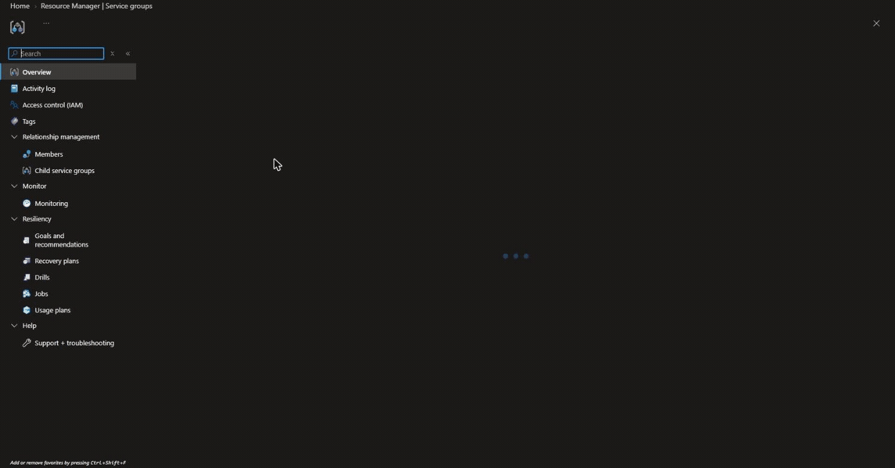

## Alerting from the SLI output

The SLI resource has one alerting property: `enableAlert: boolean`. No threshold, window or action group. Read the API and you can conclude, as I did for a day, that SLI alerting cannot be deployed as code.

It can. The configuration lives in separate `Microsoft.Insights/metricAlerts` resources using `Microsoft.Azure.Monitor.PromQLCriteria`, scoped to the Azure Monitor Workspace. `enableAlert` is a display flag; these alerts are the mechanism.

They read the SLI's own published metrics, `<sli>:Good`, `<sli>:Total`, and `<sli>:Value`:

```promql
(
  ( sum(increase({__name__="ns::<sg>/m::availability:total"}[15m]))
  - sum(increase({__name__="ns::<sg>/m::availability:good"}[15m])) )
  /
  ( sum(increase({__name__="ns::<sg>/m::availability:total"}[15m])) * (1 - 0.99) )
) > 14
```

I originally recomputed the same signal in parallel Prometheus rules. Those selectors summed across all three tiers and left `/healthz` in the denominator, making the alert materially less sensitive than the SLO. Both objects looked correct in isolation, and total-outage testing did not catch it. Detection latency was 9m47s versus 5m20s on the same outage.

Alerts derived from the SLI's own output cannot drift from it. That safety property is the whole argument.

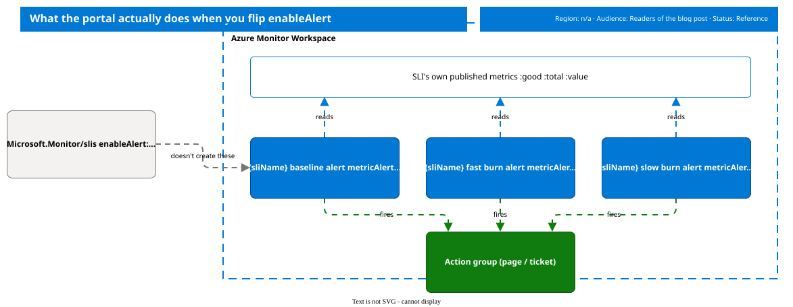

## Burn rate got me twice

Burn rate is how fast you're spending error budget. At a 99% target, a 2% error rate burns at 2x; a 20% error rate burns at 20x.

The canonical 14x over one hour and 6x over six hours assumes a 30-day budget. On a one-day window with a 0.5% budget, the long window becomes the rate limiter:

| Injected error rate | Time for the 1h window to trip |
| --- | --- |
| 95% (total outage) | ~4.5 min |
| 20% | ~22 min |
| 8% | ~54 min |

Derive the long window from the compliance window. Shortening it to 15 minutes took a 20% error rate from roughly 22 minutes to a measured 8m36s end to end.

### A correction: `sum_over_time()` was wrong here

The SLI's `:good` and `:total` are cumulative across the compliance window, not counters. `sum_over_time(...[15m])` therefore sums fifteen cumulative snapshots. It is accumulated damage, not the error rate during those fifteen minutes.

The practical consequence was a complete backend outage that ran for twelve minutes without crossing the 14x threshold. Treat the baseline attainment alert as the fast detector; keep burn-rate alerts for the budget-spend signal. If true short-window sensitivity is required, compute it from raw application counters with `rate()`, accepting the drift risk this design otherwise avoids.

### A second correction: `rate()` was not the problem

That conclusion was half wrong. `sum_over_time()`/`rate()` returning empty was true of exactly one test: a brand-new SLI queried within its first evaluation cycles. `rate()` and `increase()` need at least two samples spanning the lookback window. After a day of samples, `rate()`, `increase()` and `delta()` all returned normal values.

On identical 15-minute fault injections, `sum_over_time()` took 49 minutes to trip; `increase()` took 10m06s, most of which was the mandatory five-minute sustained-condition window. Use `increase()`, not `sum_over_time()`, and interpret an empty PromQL result as "not enough history yet" until proven otherwise.

## Giving the incident to the Azure SRE Agent

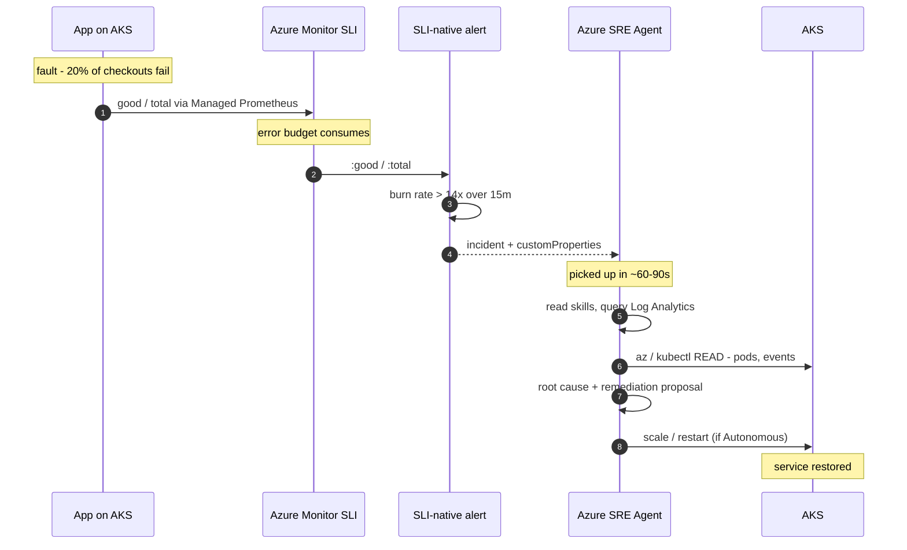

The agent subscribes to Azure Monitor directly through `incidentManagementConfiguration.type: AzMonitor`, scoped by `knowledgeGraphConfiguration.managedResources` to the resource group. It is not wired through an action group.


Each alert carries structural context:

```jsonc
{
  "sliId": "/providers/.../serviceGroups/<sg>/providers/Microsoft.Monitor/slis/availability",
  "serviceGroupId": "/providers/Microsoft.Management/serviceGroups/<sg>",
  "alertKind": "fast-burn-rate",
  "burnRate": "14",
  "lookback": "15m"
}
```

The agent can resolve `sliId` and learn the target, compliance window and filters. The incident opens as "the `/checkout` journey at the frontend edge, committed at 99% over a one-day rolling window, is at 93.4%", not "a burn-rate rule exceeded 6".

### Correlation is the fastest diagnosis

| `availability` | `external-availability` | Cause | First action |
| --- | --- | --- | --- |
| Firing | Firing | Real workload failure | Investigate pods and events |
| Healthy | Firing | DNS, load balancer, TLS | Do not restart pods |
| Firing | Healthy | Path the probe does not exercise | Compare with `journey-availability` |
| Healthy | Healthy | Suspect the telemetry | Check meta-monitoring |

Given a Deployment scaled to zero, the agent ran 31+ tool calls, queried Log Analytics, correctly root-caused the missing pods, and scaled the Deployment back up. Injection to recovery was about 20 minutes, roughly five of them detection.

On a later run it refused to declare success based only on rollout status: "the rollout completed, but the probe and workspace telemetry do not yet provide a current success sample." `kubectl` confirmed the outcome it was checking for: 2/2 ready.

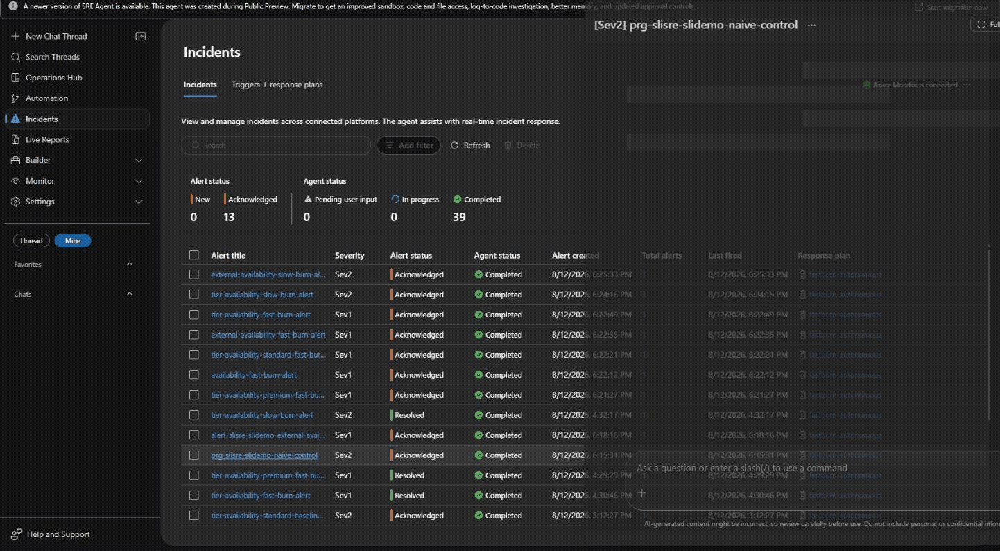

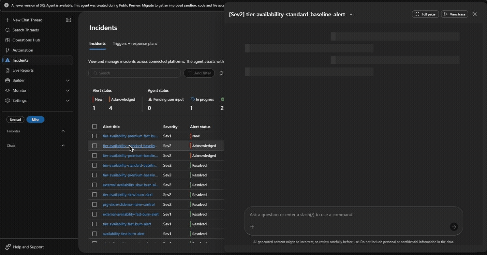

## The guardrails that failed

The agent needs Kubernetes access to act. Scope it tightly:

| Role | Scope |
| --- | --- |
| Azure Kubernetes Service Cluster User | Cluster; fetches a kubeconfig, grants nothing on its own |
| Azure Kubernetes Service RBAC Writer | One namespace |

Writer rather than Admin excludes role bindings, so the agent cannot grant itself anything further.

`PreToolUse` hooks gate individual actions, but only if their matchers bind. Mine shipped with `^(restart_|scale_).*`, copied from another framework. The real tool names are PascalCase: `RunKubectlWriteCommand`, `Terminal`, and `RunInTerminal`. The hooks matched zero tools while reporting `HooksRun: 2, FinalDecision: pass`.

When the agent remediated, it used `RunInTerminal`, not the obvious kubectl-specific tool. A matcher listing only write tools would have missed it.

A response plan with `agentMode: review` also did not prevent execution. Tested twice on an autonomous agent, every plan set to review, and it scaled a Deployment without approval. Autonomy is agent-wide; plan mode is not the safety boundary to trust. RBAC and hooks answer what the agent can do. Governance must answer who decided that it may.

### The correction that mattered: `Review` did not hold either

I wrote that `Review` was the one control that prevented writes after testing it once. It was not. Repeating the scaled-to-zero fault twice showed the supervised agent, ARM `mode: Review`, performing the scale operation without approval.

The agent's incident telemetry said `IncidentMitigatedByAgent: False` both times. Kubernetes audit logs were the only reliable witness: `kube-audit-admin` named the principal that executed the `PATCH .../scale` request.

The cause was a hook named `require-approval-for-restarts` whose content effectively said: deny unless the action is confined to the namespace, reversible, evidence-backed, and not a delete. It did not check whether a human had approved anything. The agent was grading its own homework.

I rewrote the hook to unconditionally deny and re-tested with a fresh fault injection. The autonomous agent performed the fix; the supervised agent investigated and touched nothing. One clean run is evidence, not a guarantee, so keep testing the layer underneath the telemetry.

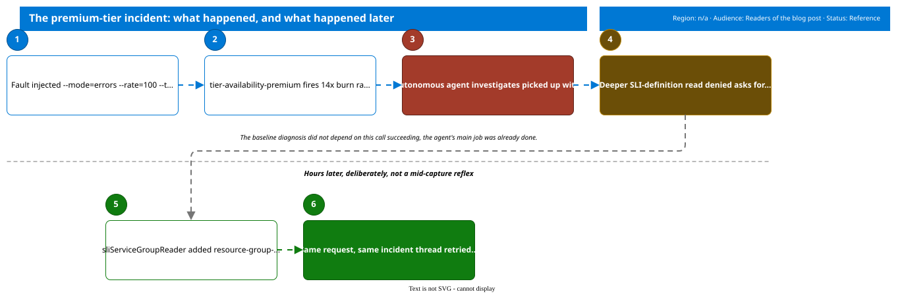

## Failures that reported nothing

- **An enabled monitoring addon does not enable collection.** `omsAgent.enabled` deploys the agent; a data collection rule makes it collect. Without the DCR, Container Insights is empty and nothing reports an error. Managed Prometheus has the same DCE/DCR/DCRA trap.
- **Absent data makes burn-rate alerts stop firing.** A zero denominator produces `NaN`, and `NaN > threshold` is false. Alert explicitly on absence with `absent()`.
- **Incident titles reach the agent URL-encoded.** `availability baseline alert` becomes `availability%20baseline%20alert`, so a plan matching spaces never matches. Name alerts without spaces.
- **Overlapping response plans disable the agent.** Several matching plans created incidents that were marked handled within a minute while running zero tools. One matching plan produced 31 tool calls and a successful remediation.

A query returning zero rows and a query that can never work are indistinguishable. Establish a positive control before believing an empty result.

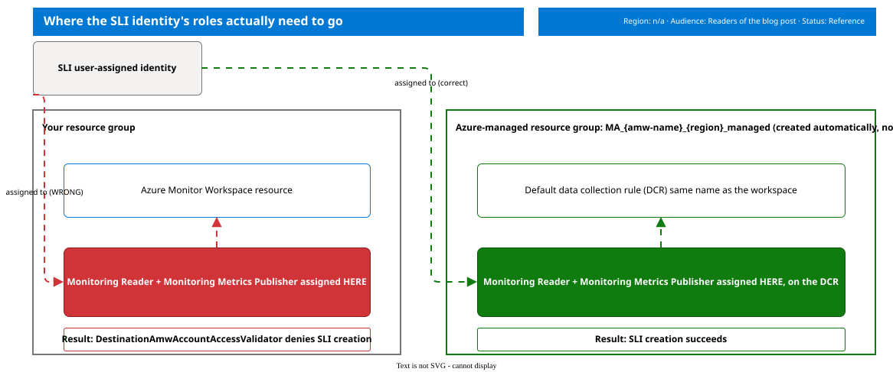

### One number for the human view

The platform engineer wanted a single pane connecting infrastructure state to user reliability. For most of this project that was two panes: pod health in Log Analytics with KQL, and SLI evaluations in the Azure Monitor Workspace with PromQL.

Workbooks support Prometheus as a data source. The JSON shape is undocumented, but the portal's own workbook uses this form:

```jsonc
{
  "queryType": 16,
  "resourceType": "microsoft.monitor/accounts",
  "crossComponentResources": ["<azure monitor workspace resource id>"],
  "query": "{\"version\":\"PrometheusQueryProvider/1.0\",\"queryText\":\"slo:error_budget:remaining_ratio\",\"type\":\"query_range\"}"
}
```

The composite panel uses the minimum attainment across every SLI rather than an average. A premium-tier outage should read "we are breaching our worst commitment", not disappear inside a blended number.

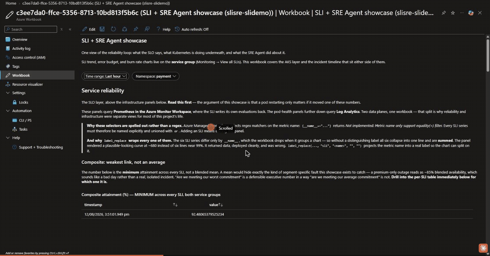

That panel also closes the reporting gap for the engineering manager, who needs credible error-budget reporting but is least likely to browse nine SLI charts. Alerting on a number is not the same as being able to see its trend.

### What it still does not do

- The in-cluster SLIs still measure in-cluster traffic. `external-availability` covers the public path; the rest are blind to ingress and DNS by construction.
- The tier SLA table is a draft, not a signed contract. Differentiated targets exist and alert independently, but nothing enforces the SLA outside that policy document.
- The one-day compliance window is a demo choice so the budget visibly moves. Never copy `evaluationPeriodDays: 1` into production without an explicit decision.
- SLOs do not detect outages faster than a probe. On the same outage, the external web test fired in 3m37s and the burn-rate alert in roughly five minutes. SLOs earn their place in the ambiguous middle: deciding whether a 2% error rate is worth waking someone for.

## What I would repeat

Measure the user, not the application. Ask what moves if DNS breaks. If none of the signals move, you have instrumentation, not an SLO.

Derive alerts from the SLI, never alongside it. A parallel implementation will drift silently toward being less sensitive than the SLO it enforces, and it will pass testing because total outages trip almost anything.

Verify guardrails by trying to breach them. Hooks that match nothing, plan modes that do not supervise, and rules that never evaluate all look identical to ones that work. The difference is visible only when you inject a fault and watch what happens.

:::info
The repository, including the Bicep, fault-injection scripts, and agent configuration, is public: [lukemurraynz/AzureSLI-AzureSREAgent](https://github.com/lukemurraynz/AzureSLI-AzureSREAgent).
:::

