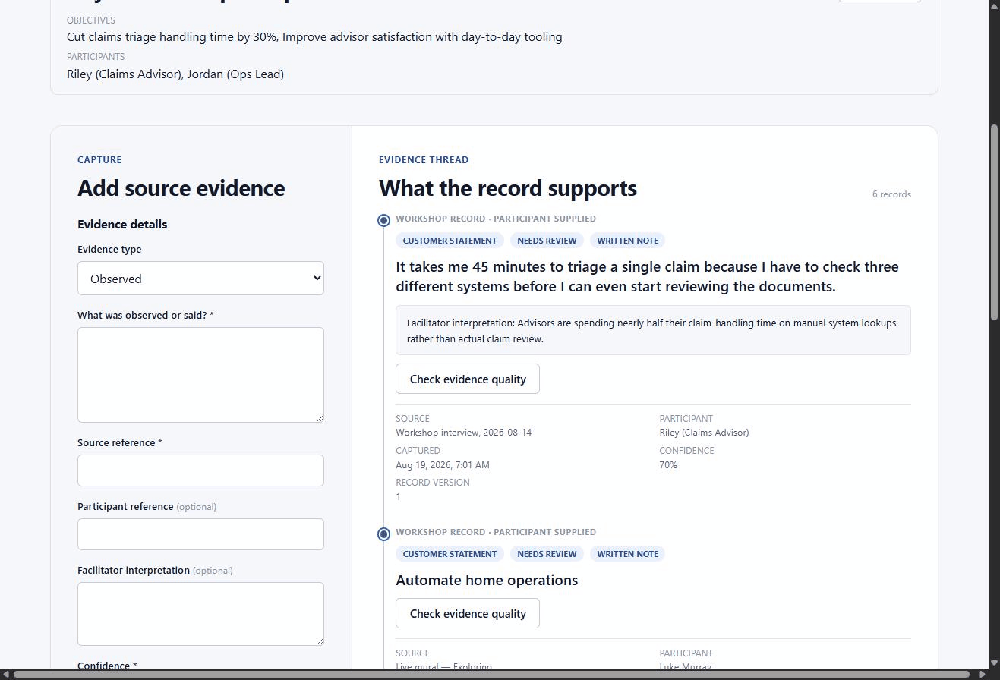
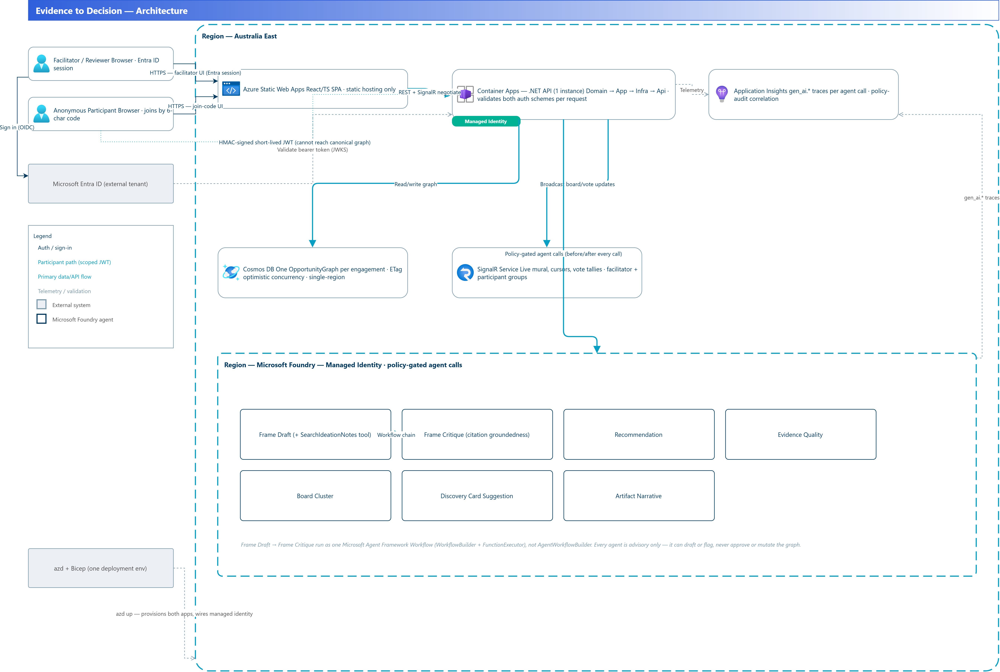
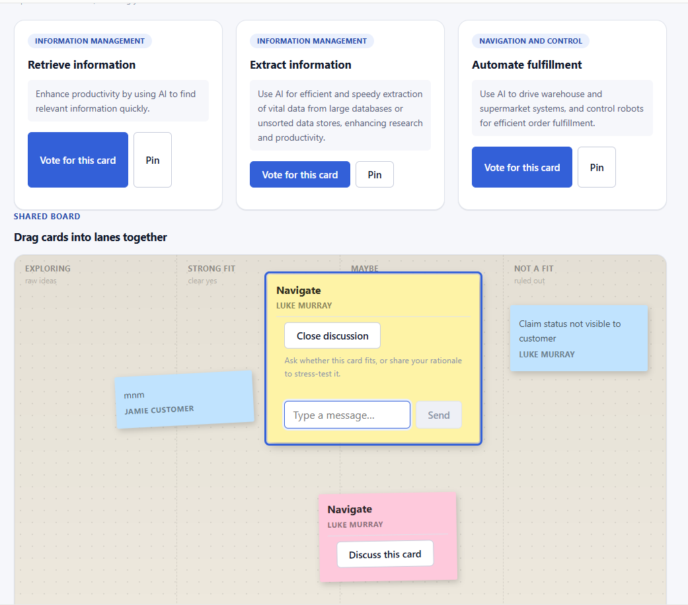
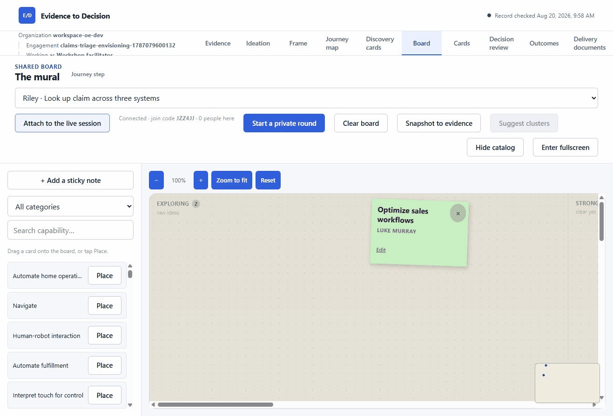
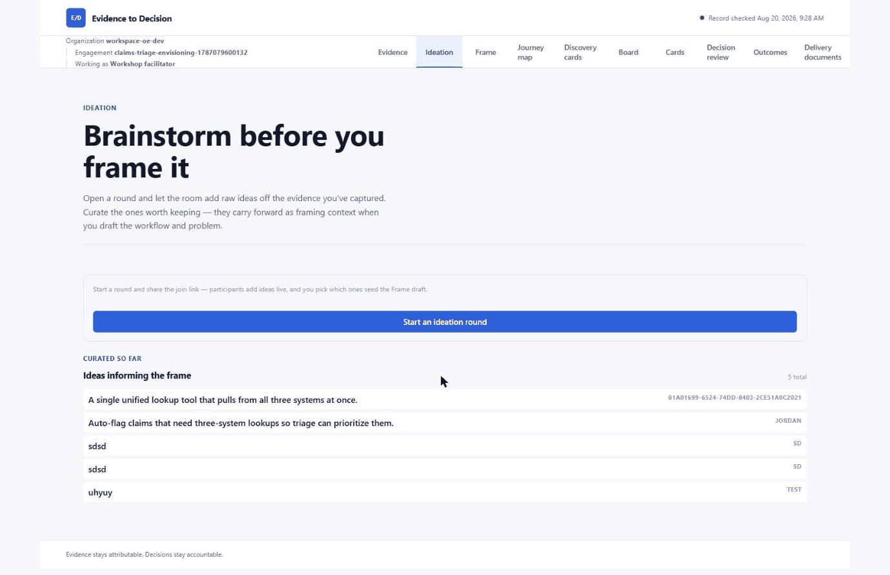
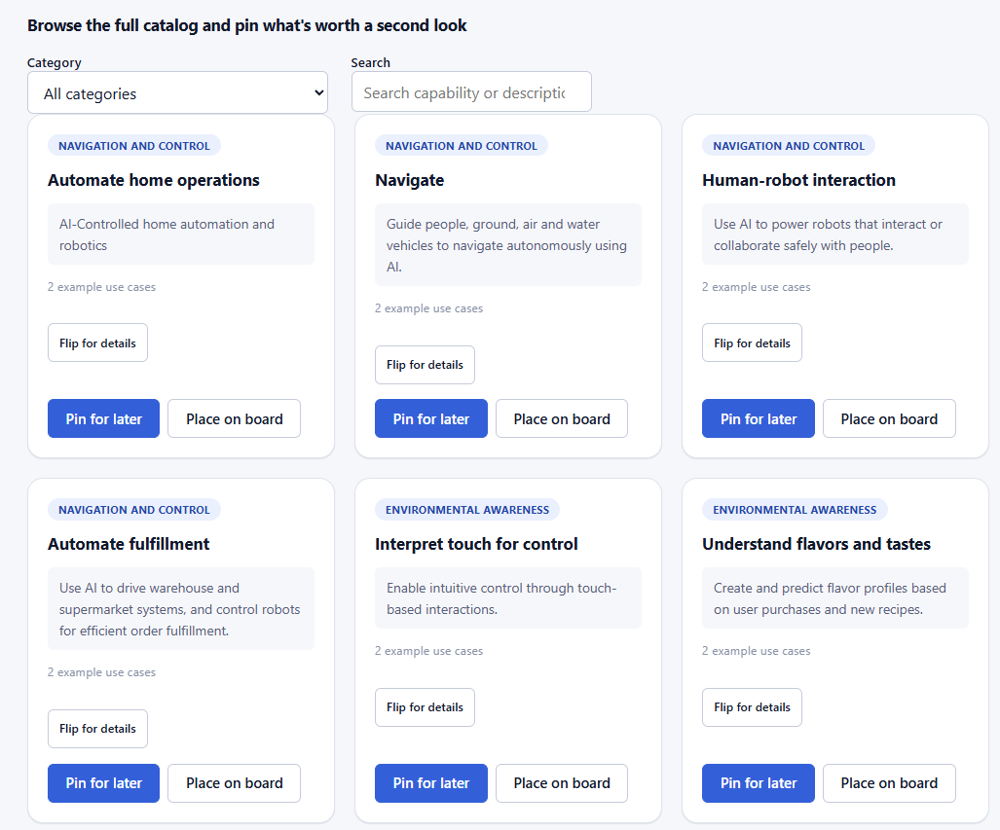
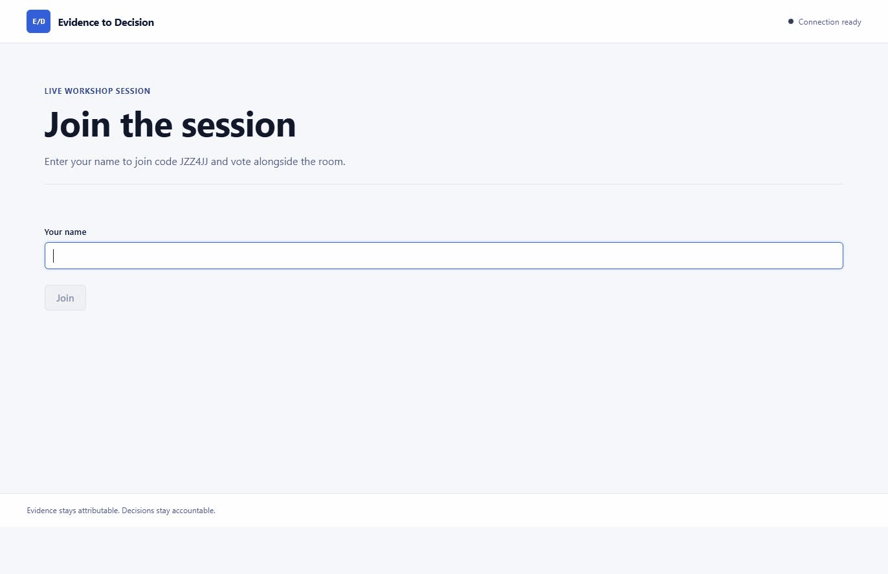

Most "AI workshop" tooling is either a whiteboard with sticky notes or a slide deck. I built something different. [Evidence to Decision](https://github.com/lukemurraynz/evidence-to-decision) is a governed, evidence-first pipeline. A facilitator captures what people actually said, the room votes and clusters live on a shared mural, an Azure AI agent drafts a starting problem framing from that evidence alone, a reviewer approves or blocks it, and only then does it become a delivery document. Every step keeps the paper trail. This is why I shaped it that way, and what it took to build on Azure.

<!-- truncate -->

> You've been in the room. The energy is good, the sticky notes pile up faster than you can read them, and half the team thinks the key insight was something someone mentioned in passing at 2:15 PM. When you're trying to hand off to delivery two weeks later, the connection between "what a customer said" and "what the team decided to build" usually lives in someone's memory, not a record.

That gap is the point of Evidence to Decision. I set one constraint and let it drive everything else: evidence stays attributable, and decisions stay accountable. An AI agent can draft and recommend, but it can never approve or mutate canonical state. That rule shapes the domain model, the agent prompts, and the UI.

The pipeline works like this: facilitators capture evidence (what was said, by whom, about what), the room runs through ideation rounds with live voting and clustering on a shared mural, an AI agent drafts a candidate problem frame citing the evidence it sees, a reviewer approves or blocks the draft, and only then does the frame become canonical. Every step is a separate surface, every transition requires human judgment, and the AI is advisory-only.

## Architecture

I went for clean architecture: Domain / Application / Infrastructure / API layers, with a single canonical `OpportunityGraph` per engagement as the only authoritative state. Everything else (recommendations, cards, review views, handoff artefacts) is derived and cannot approve or mutate it.

Cosmos DB holds an event-style record of the graph, with optimistic concurrency via ETags on every mutation. It is the only system of record.

Azure SignalR Service backs the live surfaces. Vote tallies update as people vote, live cursors show where other facilitators are pointing, and the shared mural broadcasts placements and drags in real time.

Microsoft Foundry and Microsoft Agent Framework power the AI capabilities: recommendation drafting, Discovery Card suggestions, evidence-quality checks, Frame drafting, and board clustering. Each uses the same audited, policy-gated call pattern. There are seven agents, including a Frame-drafting agent that triggers an automated critique workflow through Agent Framework.

Azure Container Apps hosts the API and Azure Static Web Apps hosts the frontend. Bicep deploys both from one `azd` environment, using managed identity throughout instead of connection strings or account keys.

Entra ID authenticates facilitators and reviewers. Anonymous workshop participants use a separate HMAC-signed, short-lived JWT scheme. It lets them vote, view, and comment, but it cannot mutate the canonical graph.

## The live mural, without a whiteboard SDK

I built the shared canvas (zoom and pan, drag-to-place cards, live cursors, undo, private and reveal rounds, fullscreen presenter mode) directly on Azure SignalR groups rather than reaching for a commercial whiteboard SDK.

SignalR groups are opaque. You can broadcast to a group, but you cannot enumerate its members. That constraint shaped how "start a new private round" works. In a private round, only facilitators see the cards until someone reveals them. The server tracks round state, and clients ask whether reveal mode is active on every render.

The zoom and pan math, the mini-map, and the zone-count overlay are all built on normalised (0..1) card coordinates that stay meaningful regardless of canvas size. That way a card placed on the big screen stays in the same relative position when someone's viewing it on a laptop or a tablet.

## AI drafts, never decides

This is the bit that took the most tuning. The Frame-drafting agent only sees evidence explicitly captured in the workshop. It cites literal evidence IDs (never invents or paraphrases one). A deterministic C# validator rejects any output that cites something outside its authorised context before a human ever sees it.

Every agent shares the same advisory-only contract: never approve a gate, never claim to mutate canonical state, and always name what a human still needs to check. The Frame-draft agent can search ideation notes beyond the default recency window. It then passes its draft to a citation-groundedness critique workflow in Agent Framework. `frame_draft.generate` feeds into `frame_critique.generate` under one operation, with `gen_ai.usage.input_tokens`, `gen_ai.usage.output_tokens`, and `critique.concern_count: 0` showing that the critique stage ran without raising a concern.

I planted weak evidence twice, an invented "80% faster at another company, never verified" claim, to see if the agent would cite it. It did not. The draft agent cited the stronger evidence before the critique agent ran.

Also live: "Ask AI for card suggestions" on the Discovery Cards page. A second, independent agent (FoundryDiscoveryCardSuggestionAgent) reads the current persona and journey step and proposes AI-capability cards with a one-line rationale tied to that persona's actual pain point. Each is addable to the shortlist with one click.

## Governance is part of the product

Every model call and consequential action is checked against an allow-listed set of evaluation points and tools, in `evaluation-only` or `enforce` mode. Every decision is written to an append-only audit sink.

Decision review is where state actually becomes approved. A human evaluates trust and readiness, names blockers (if any), records a decision. It's the only place that flows into canonical state.

The audit trail lives in Application Insights alongside the regular telemetry: `policy.gate_name`, `policy.mode`, `policy.result`, and the full context of what the model saw and what it returned. You can trace from a delivery document back through the approval chain back to the original evidence.

## Shipping on Azure

The Container Apps API and Static Web Apps frontend deploy together from one `azd` environment. They use managed identity, with no connection strings in configuration. Bicep configures CORS, SignalR groups, and the Foundry connections.

I started on .NET 8 and moved to the .NET 11 preview partway through. It brought newer LINQ features and better performance on hot paths. It also meant waiting for a few NuGet packages tied to the release calendar before production.

I tested every feature in a browser against the deployed app as well as running unit tests. That found a client-side "Start an Ideation Round" error. Backend session creation succeeds, and Application Insights records 200 responses, but the client does not receive the message. I documented it as a separate follow-up because it does not block this workflow.

## The output is evidence-first delivery

The final artefact is a generated delivery document (a technical delivery brief) built from the approved opportunity record. It includes an AI-written summary explicitly labelled "NOT VERIFIED" with a note that a human should check it against the structured fields below.

It's the same drafts-never-decides contract right down to the last page. The AI suggests, the human approves.

## Why this shape matters

Most enterprise AI features follow a simple pattern: the AI acts and the human watches. Evidence to Decision makes the human create the record and decision, while the AI suggests patterns in the evidence. This takes more effort, but it leaves an auditable decision chain six months later.

For an AI-envisioning workshop tool, that record is the product. The customers funding this need a defensible way to turn workshops into delivery, not a faster sticky note app.

I built it on Azure because Foundry, Agent Framework, SignalR, Cosmos DB, and Entra ID provide those capabilities without custom infrastructure. The platform supports the policy gates, audit trail, and identity model this workflow needs.

For AI features that need to stay accountable, use the same sequence: evidence → recommendation → review → decision. Let the AI suggest. Keep approval and the record with people.

## Links

- [Microsoft Foundry](https://learn.microsoft.com/azure/foundry/what-is-foundry?WT.mc_id=AZ-MVP-5004796)
- [Microsoft Agent Framework](https://learn.microsoft.com/agent-framework/overview/?pivots=programming-language-csharp&WT.mc_id=AZ-MVP-5004796)
- [Azure SignalR Service](https://learn.microsoft.com/azure/azure-signalr/signalr-overview?WT.mc_id=AZ-MVP-5004796)
- [Azure Container Apps](https://learn.microsoft.com/azure/container-apps/overview?WT.mc_id=AZ-MVP-5004796)
- [Azure Static Web Apps](https://learn.microsoft.com/azure/static-web-apps/overview?WT.mc_id=AZ-MVP-5004796)
