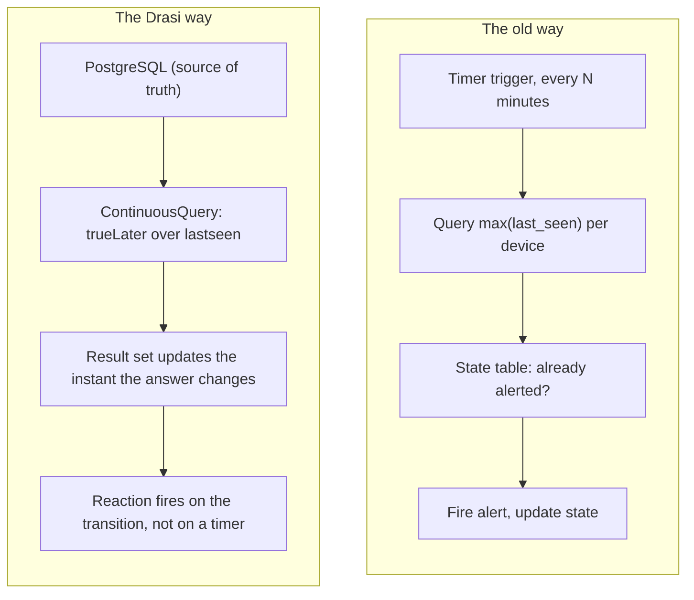
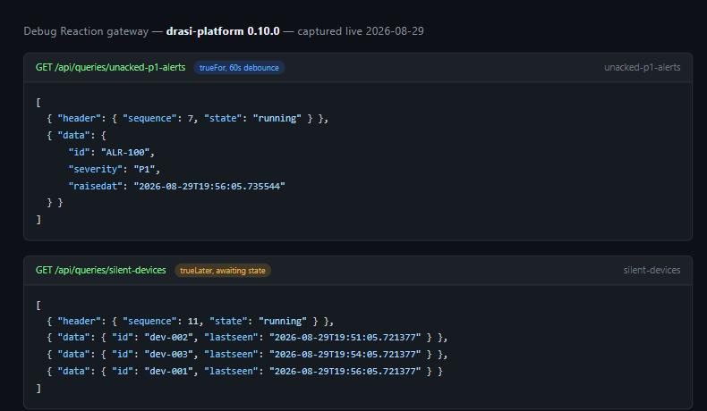

I have written more "check if X hasn't happened in N minutes" pollers than I care to admit. A timer-triggered Function, a state table to remember the last time you checked, some dedup logic so you don't page the same person twice, and a nagging feeling that the poll interval itself is a bug waiting to happen (miss the window and the alert arrives late, or not at all). It works, but it is infrastructure you built to answer a question your database should just be able to answer on its own.

That is the pitch behind [Drasi](https://drasi.io/), a CNCF Sandbox project for continuous queries over changing data. I have been spending time with it against a real AKS cluster and Azure Database for PostgreSQL, and the piece that impressed me most was not the happy path, it was how it handles the question SQL genuinely cannot express well: "alert me when something *stops* happening."

<!-- truncate -->

## The polling tax

"Alert me if a device hasn't checked in for 20 minutes" sounds like a simple requirement until you have to build it. The honest version needs a poller running on a schedule, a query for `max(last_seen)` per device, a state table so you don't re-fire the same alert every poll cycle, and careful handling of the boundary between polls (a device that goes quiet at minute 19 of a 20-minute check shouldn't wait an extra cycle to be noticed). None of that logic is really about your business problem. It is scaffolding built entirely to compensate for the fact that a normal query can only tell you what is true right now, not what has failed to happen over a window of time.

Drasi's standing queries flip this. You write the query once, and the result set is always current, maintained continuously as the underlying data changes, rather than recomputed on a schedule.



The left side is every poller I have ever written, and that's the set of problems that sold me on this. The right side is the same requirement with the scaffolding gone, no timer, no state table, no dedup logic. The result set is the state now, it maintains itself, and for absence specifically a pair of temporal functions carry the whole thing.

## The function toolbox

| Function | Signature | Semantics |
|---|---|---|
| `drasi.trueFor` | `trueFor(expr, duration)` | `expr` must stay true continuously for `duration` from the change time before an `added` result fires |
| `drasi.trueLater` | `trueLater(expr, timestamp)` | evaluates `expr` at a future `timestamp`, returns `drasi.awaiting` meanwhile and re-schedules |
| `drasi.trueUntil` | `trueUntil(expr, timestamp)` | `expr` must remain true until `timestamp` |

:::danger
`drasi.slidingWindow` is documented (it's in the official Drasi custom functions reference), but it is not registered at the pinned 0.10.0 platform release. I wrote a query against it expecting an aggregation over a trailing window, and got `UnknownFunction("drasi.slidingWindow")` back instead, a hard failure, not a silent no-op. If you want a trailing-window aggregation today, you'll need to check the function actually exists on your pinned release before you build anything on top of it, the documentation is ahead of what 0.10.0 actually ships.
:::

`trueLater` is the one worth sitting with for a minute. While it waits for its scheduled timestamp it returns the special value `drasi.awaiting`, so the result set legitimately holds rows that haven't resolved yet. I tested this against a live cluster, and it's specific to `trueLater`: a `trueFor` row stays hidden entirely until the debounce window elapses, it never surfaces in an awaiting state. If you conflate the two, your reaction logic will treat a perfectly normal pending row as a bug, which is a hard thing to spot when you're staring at a result set that "should" be empty.

## Worked example: the silent sensor

The pattern that sold me on the whole model is the "device gone quiet" query, because it has to do two things at once: catch devices that are *already* overdue when the query is created, and schedule a future check for devices that will go quiet later.

```cypher
MATCH (d:devices)
WHERE drasi.trueLater(
      datetime() >= datetime(d.lastseen + 'Z') + duration({ minutes: 20 }),
      datetime(d.lastseen + 'Z') + duration({ minutes: 20 }))
RETURN d.id AS id, d.lastseen AS lastseen
```

That `+ 'Z'` is not decoration. PostgreSQL's `timestamptz` columns arrive over the wire as offset-less ISO strings (`2026-08-26T05:35:41.699091`, no timezone marker), and feeding that straight into `datetime()` throws `FunctionError: InvalidFormat` because it wants an RFC 3339 string. Worse, it doesn't fail on just the bad row, it terminal-errors the whole query on the first element it touches. Appending the offset before parsing fixes it.

:::warning
Still chasing this one, so treat it as an open question rather than a fix: after this query had been running cleanly for a while, I inserted and then deleted a device row on the same table, and recreating the query afterwards hit the identical `datetime` error against rows that had parsed fine for hours. My working theory is that once a row in a CDC-tracked table goes through a live streaming-replication event, the source's cached representation of its `timestamptz` values can flip from offset-less to offset-included, which would silently break the `+ 'Z'` fix. I haven't nailed the root cause yet. If you hit this, check whether the affected table has had any live inserts or deletes since the query last bootstrapped cleanly.
:::

## Worked example: unacknowledged alert escalation

The silent-sensor pattern schedules one future check per device. The second half of absence detection is the sustained condition: not "has it gone quiet," but "has this been true for too long." That is a different function, `trueFor`, and it is the difference between escalation-as-a-query and escalation-as-a-workflow-engine:

```cypher
MATCH (a:alerts)
WHERE a.severity = 'P1'
  AND a.acknowledgedby IS NULL
  AND drasi.trueFor(
        a.severity = 'P1' AND a.acknowledgedby IS NULL,
        duration({ seconds: 60 }))
RETURN a.id AS id, a.severity AS severity, a.raisedat AS raisedat
```

Read the two together and the mental model falls out: `trueLater` puts a row in the result set at a future moment, `trueFor` keeps a row out until a condition has held continuously. One schedules, the other debounces. That pairing is really the whole of what absence detection needs, applied two different ways.

I tested this with a shortened 60-second window rather than a real SLA, purely to see the transition without waiting around. `ALR-100`, a P1 alert with nobody assigned, entered the result set only once the full 60 seconds of continuous truth had elapsed, never before. Use whatever duration your actual SLA needs, the mechanism doesn't care.



Both results above came straight off the Debug Reaction gateway (`GET /api/queries/{id}`) against a live cluster, not a docs example. The three devices sitting in the `silent-devices` result set are the `trueLater` awaiting state in practice, present in the result well before their 20-minute deadlines, each carrying its `lastseen` value so a reaction can show useful context rather than a bare row.

:::tip Reading the two result sets
Once this is wired up correctly, here's the behaviour you should actually see, and what tells you something's wrong if you don't. `unacked-p1-alerts` stays empty the entire time an alert is unacknowledged but young, gains a row the instant the debounce window elapses, and never gains a row at all if someone acknowledges it first. If a row appears immediately on creation, your `trueFor` isn't debouncing, check the duration argument. `silent-devices` should show every device currently being tracked, each one sitting quietly with its real `lastseen` timestamp, `awaiting` rather than absent, right up until its 20-minute deadline actually passes. If a device is missing from the result set entirely rather than present-and-awaiting, that's the sign something upstream of the query, not the query itself, has gone wrong.
:::

## Gotchas from a live build

Each of these cost me a debugging round against a real Azure PostgreSQL Flexible Server and AKS, so here they are up front rather than buried in a support thread somewhere:

1. **Grant ordering.** Running `GRANT SELECT ... ON ALL TABLES` before the tables exist grants nothing to anything created afterwards. Bootstrap then fails with `permission denied for table`.
2. **`timestamptz` arrives as an offset-less ISO string.** Covered above, `datetime(col)` alone throws and terminal-errors the whole query.
3. **The 0.10.x PostgreSQL source manages its own filtered publication** (`rg_<source-name>`), in addition to any you create yourself. It needs, in order, `CREATE ON DATABASE`, table ownership (for publication membership, which itself needs `GRANT drasi_user TO admin`), and `CREATE ON SCHEMA public` for the new owner. Bootstrap works fine without any of this, streaming just dies silently, which is the trap.
4. **`wal_level=logical` is a static Postgres parameter.** ARM reports `value=logical` the instant you set it, but the running server stays on `replica` until a full restart. Symptom: bootstrap succeeds, zero changes ever stream, and slot creation fails with "logical decoding requires wal_level >= logical."
5. **The server admin login doesn't have the `REPLICATION` attribute by default**, even as a member of `azure_pg_admin`. Point a source straight at the admin login (rather than a dedicated replication role) and it fails with a different error again, `FATAL: permission denied to start WAL sender`. Fix: `ALTER ROLE <login> WITH REPLICATION;`.
6. **Deleting a row can crash the entire reactivator, not just the affected query.** Postgres's default `REPLICA IDENTITY` only sends primary-key columns in a DELETE's old-row image, everything else arrives as `null`. Drasi generates a message schema mirroring your `NOT NULL` constraints, so a legitimately-null column in that DELETE event fails the generated schema's own validation and takes the whole connector down (`Invalid value: null used for required field`, then `CrashLoopBackOff`). Run `ALTER TABLE <table> REPLICA IDENTITY FULL;` on any watched table with `NOT NULL` columns outside the primary key, before you ever delete a row from it.
7. **`drasi apply` is not an upsert.** Re-applying an existing `ContinuousQuery` returns `500 Internal Server Error`, and it blocks every other document in the same multi-doc file from applying. Delete, then apply.
8. **Default providers are auto-registered.** Older guidance saying source and reaction providers need a separate apply step after `drasi init` is stale for the current CLI generation, I watched them register automatically during init.

## When not to do this

Standing queries are the wrong tool for high-frequency flapping conditions on their own, a raw absence check on something that oscillates rapidly will fire constantly. Combine it with `trueFor` to debounce rather than alerting on every raw transition, the escalation example above is really that same pattern applied to alert acknowledgement.

That's enough to go and swap a poller for a standing query. The gotchas above are the ones that cost me actual debugging rounds, so hopefully they read as a head start rather than a repeat of the same wall.

## References

- [Drasi documentation](https://drasi.io/)
- [Drasi custom functions reference](https://drasi.io/reference/query-language/drasi-custom-functions/)
- [Drasi for Kubernetes installation guides](https://drasi.io/drasi-kubernetes/how-to-guides/installation/)
- [Azure Database for PostgreSQL Flexible Server - logical replication](https://learn.microsoft.com/azure/postgresql/configure-maintain/concepts-logical?WT.mc_id=AZ-MVP-5004796)
- [drasi-project/drasi-platform](https://github.com/drasi-project/drasi-platform)
