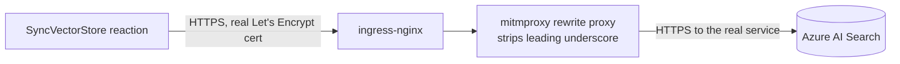

I was wiring up the [Drasi](https://drasi.io/) SyncVectorStore reaction against Azure AI Search when it crash-looped on startup with what looked like a straightforward Azure AI Search naming restriction. The reaction contains a one-character bug in two places, with no YAML setting, secret reference, or config flag that routes around it. Getting it working meant reading the reaction's source, proving the exact constraint with a live REST test, and building the fix as network infrastructure rather than waiting on an upstream release.

<!-- truncate -->

## The symptom

Point `vectorStoreType` at `AzureAISearch` and the reaction pod crash-loops before it processes a single event:

```
Vector store connectivity test failed for collection _drasi_test_<hash>
... Index name must only contain lowercase letters, digits or dashes
```

My first read of that was the obvious one: Azure AI Search must forbid underscores in index names, and the reaction's self-test happens to generate one. Case closed, use a different backend. Except the fix has to survive a search service that's already working correctly for every other collection in the same account, so "underscores are banned" was worth checking rather than assuming.

## Reading the source instead of the error text

The reaction is open source, and the crash trace pointed straight at a specific method. `QueryInitializationService.cs` runs a connectivity self-test before it touches any of your configuration:

```csharp
private async Task TestVectorStoreConnectivity(CancellationToken cancellationToken)
{
    var testCollectionName = $"_drasi_test_{Guid.NewGuid():N}";
    // ... creates a collection with this exact name, then throws if it fails
}
```

That call happens as the literal first line of `InitializeQueriesAsync()`, before per-query config, before `createCollection: false` on your own collection gets read, before anything you control has a chance to run. No secret reference, no alternate collection name, no client-side setting avoids it. The self-test builds its own configuration object from scratch every time.

So the question stopped being "how do I configure around this" and became "what is the actual naming rule, and is it really as broad as the error text implies." I tested it directly against the live search service rather than trust the message:

```bash
curl -X PUT "$ENDPOINT/indexes('drasi_test_abc123')?api-version=2024-07-01" -H "api-key: $KEY" -d @schema.json
# HTTP 201 Created

curl -X PUT "$ENDPOINT/indexes('_drasi_test_abc123')?api-version=2024-07-01" -H "api-key: $KEY" -d @schema.json
# HTTP 400 InvalidName
```

Same schema, same account, one character different. Microsoft's own naming-rules documentation confirms the actual constraint: an index name must start with a letter or digit. The error text only calls out the dash rule explicitly, which is why "no underscores" is such an easy wrong conclusion to reach from the message alone. The real rule is narrower: no leading underscore or dash, full stop. Underscores anywhere else in the name are completely fine.

That distinction matters because it changes what the fix has to be. "No underscores" is unfixable without owning the reaction's source. "No leading underscore" is a single character.

## The bug shows up twice, not once

Once I'd worked around the first occurrence (more on how below), the reaction crash-looped again on a second, more consequential prefix. `SyncPointManager.cs` hardcodes the name of the permanent collection every reaction instance uses to track what it's already processed:

```csharp
private const string MetadataCollectionPrefix = "_drasi_metadata_";
```

This is the sync-point bookkeeping the reaction depends on for its entire lifetime, created fresh on every bootstrap. An upstream fix limited to the self-test's name would still leave AzureAISearch unusable because this collection hits the same constraint. Both prefixes need the same one-character correction.

## Why a proxy alone wasn't enough

The obvious workaround, once you know the exact string being generated, is a reverse proxy that rewrites the name in flight: catch any request path or body containing `_drasi_` and strip the leading underscore before it reaches the real service. I built this with `mitmproxy` in reverse mode and a short addon script, and it worked exactly as expected against the naming check.

It still crashed, on a different exception:

```
System.ArgumentException: endpoint only supports https. (Parameter 'endpoint')
   at Azure.Search.Documents.SearchExtensions.AssertHttpsScheme(Uri endpoint, String paramName)
```

The Azure Search SDK refuses a plain HTTP endpoint outright, and there's no configuration surface on the reaction to disable certificate validation either. A self-signed certificate on the proxy wouldn't have helped: the .NET client validates the certificate chain the same way it would for any other HTTPS call, and nothing in the reaction's config lets you skip that. Getting past both problems meant the proxy needed a certificate a real public certificate authority actually issued.



## Building the rest of it

Standing up a trusted certificate for a Kubernetes-hosted test service, without owning a domain, took three pieces:

- `ingress-nginx` and `cert-manager`, both official Helm charts, installed with no changes beyond the defaults.
- A `ClusterIssuer` for Let's Encrypt production, using the HTTP-01 challenge against the ingress.
- A hostname to issue the certificate for. I looked at `dnsbox.io` first, which turned out to be self-hosted DNS-authority software you install and run yourself as an internet-facing nameserver, a bigger trust decision than the problem warranted. `nip.io` is simpler: it's a wildcard DNS resolver that maps an IP address straight into a hostname (`20-40-178-12.nip.io` resolves to `20.40.178.12`), no signup, nothing to install, nothing running on your own infrastructure that you'd need to trust.

With the ingress's public IP in hand, an `Ingress` resource pointed at that nip.io hostname, and the ClusterIssuer annotation in place, cert-manager requested a certificate. It failed the first time, and not for a reason that had anything to do with certificates.

## The gotcha that looked like a firewall problem

External traffic to the ingress timed out completely, both from a plain `curl` and from Let's Encrypt's own HTTP-01 validator. Every layer I checked looked correct: the pod was `Ready`, the Kubernetes `Service` had an external IP, and the network security group had an explicit allow rule for ports 80 and 443 from the internet. None of that mattered.

The actual cause was Azure's Standard Load Balancer, which by default health-checks the same node port your real traffic uses, on path `/`. `ingress-nginx`'s default backend returns a `404` for any request whose `Host` header doesn't match a configured `Ingress`, which is exactly what an untargeted Azure health probe sends. Azure marked the backend unhealthy and dropped every packet to it, which looks identical to a firewall block from the outside while every dashboard claims the service is healthy.

```bash
kubectl annotate svc ingress-nginx-controller -n ingress-nginx \
  service.beta.kubernetes.io/azure-load-balancer-health-probe-request-path=/healthz
```

That points the probe at ingress-nginx's own always-200 health endpoint instead of the data path. My first attempt at this exact command silently failed for a completely different reason: Git Bash on Windows rewrites a bare leading slash before `kubectl` ever sees it, so `/healthz` became `C:/Program Files/Git/healthz` with no error from anything. `MSYS_NO_PATHCONV=1` in front of the command, or doubling the leading slash, avoids it. Worth knowing if you're running `kubectl` or `az` from Git Bash on Windows and an argument starts with `/`.

## Confirming the fix

With the health probe fixed, the certificate issued on the first real attempt. I pointed the reaction's `connectionString` at the proxy's new HTTPS hostname, triggered a genuine write against the underlying Postgres table, and watched the reaction log a real embedding call and a real upsert. Rather than trust that log line the way I'd learned not to trust the original error text, I checked the actual index directly, with no proxy in the request path this time:

```bash
curl "$ENDPOINT/indexes('products-test')/docs('prod-1')?api-version=2024-07-01" -H "api-key: $KEY"
```

The response came back with the real product row and its full 3072-dimension embedding vector, stored in the real Azure AI Search service. AzureAISearch isn't a backend to avoid at this platform version. It's a backend that needs one string fixed in two places, and until that ships upstream, a rewrite proxy in front of a properly certificated endpoint gets you the rest of the way there.

## Operational notes

None of this is something to leave running. The proxy holds a real Azure AI Search admin key, and standing up a public ingress means exactly that: public. Within an hour of the certificate issuing, the access log already showed automated scanning traffic hitting the IP on unrelated paths, fake browser user agents probing for open admin panels and API endpoints that don't exist here. Ordinary background noise for anything with a public IP, not an attack on this setup specifically, but a reminder that "it's just a test proxy" doesn't make it invisible.

Nothing here (`ingress-nginx`, `cert-manager`, the proxy deployment, the `ClusterIssuer`) was provisioned through the project's own infrastructure-as-code, so `azd down` or an equivalent teardown of the managed resources won't remove any of it. Tear it down explicitly, and don't leave a naming-rewrite proxy with a live admin key sitting on the internet longer than the test needs.

## What this is actually worth

The specific bug will get fixed or it won't. What's reusable is the checking habit: an error message describes what a service noticed, not necessarily the actual rule. "Index names forbid underscores" was a plausible reading of that error text and it was wrong, in a way that would have sent me down a much longer path (switching vector store backends entirely) if I hadn't tested the boundary case directly. When a config surface won't budge and the fix looks like it needs to live outside the application, ask whether the actual constraint is narrower than the failure message suggests before reaching for infrastructure.

## References

- [Azure AI Search - index naming rules](https://learn.microsoft.com/rest/api/searchservice/naming-rules?WT.mc_id=AZ-MVP-5004796)
- [drasi-project/drasi-platform](https://github.com/drasi-project/drasi-platform)
- [cert-manager documentation](https://cert-manager.io/docs/)
- [ingress-nginx documentation](https://kubernetes.github.io/ingress-nginx/)
- [nip.io](https://nip.io/)
