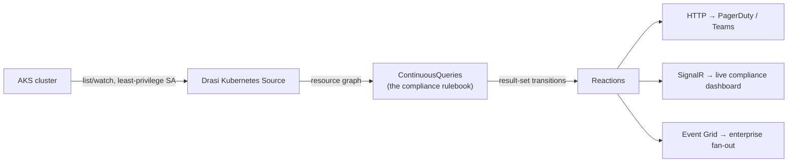

Every AKS cluster running GitOps already has tools watching for drift. Gatekeeper or Kyverno block bad configuration at admission time. Flux or Argo tell you when the live cluster has drifted from git. Prometheus alerts fire on metrics with a `for:` duration. None of them are wrong to have, and I am not going to pretend Drasi replaces any of them. What they all share is a boundary: each one is good at the specific thing it watches, and none of them answers a question that cuts across a few resource types at once.

Drasi answers *relational* questions about live cluster state after admission: is this Deployment still under-replicated after five minutes, and is that Pod running an unapproved image? I tested standing queries over a live AKS resource graph. Only two of the six rules I set out to build survived unchanged; the gap between what looked right on paper and what ran was the useful result.

<!-- truncate -->

## What each tool actually owns

| Tool class | Owns | Can't do |
|---|---|---|
| Gatekeeper / Kyverno | Admission-time policy (block at create) | Runtime drift, state that mutates *after* admission and decays over time |
| Flux / Argo | Git to cluster sync diff | Arbitrary state questions not tied to git |
| Prometheus alerts | Metrics with a `for:` duration | Cross-resource relational joins (Deployment to ReplicaSet to Pod lineage, namespace to NetworkPolicy absence) |

Drasi's niche is standing Cypher over the live resource graph, with temporal functions (`trueFor`, `trueLater`) and a result set that stays current on its own. Reactions fire on transitions, not on poll ticks.



Deploy Drasi into the same cluster, or point an external instance at it via a kubeconfig Secret. RBAC matters here: the source credential only needs `list`/`watch` on the resource types your rules actually read, scope it the way you'd scope a read-only dashboard service account.

## The rulebook, corrected

I wrote six rules against the documentation first, then ran every one of them against a live cluster with deliberately induced violations. Only two survived unchanged. Two needed rewriting, and two don't work at all, and that last pair isn't because of a query bug.

| Rule | Verdict | Why |
|---|---|---|
| Under-replicated sustained | Works, rewritten | Needed `coalesce(status.readyReplicas, 0)`, the field is null during rollout |
| Unapproved registry images | Works, rewritten | `STARTS WITH` doesn't parse in the pinned Cypher subset |
| Namespaces without NetworkPolicy | Cut | NetworkPolicy and Namespace aren't in the Kubernetes Source's fixed watch list |
| Certificate expiry (TLS Secrets) | Cut | Secret isn't in the watch list either |
| PodDisruptionBudget exhaustion | Cut | PodDisruptionBudget isn't watched |
| Sustained node pressure | Works, rewritten, syntax proven | Node is watched, needs the same `unwind` as containers, live violation deliberately not induced (shared control-plane node) |

The Kubernetes source watches a fixed list of twelve resource types, no matter what your queries reference: Pod, Deployment, ReplicaSet, StatefulSet, DaemonSet, Job, Service, ServiceAccount, Node, Ingress, PersistentVolume, and PersistentVolumeClaim. Namespace, NetworkPolicy, PodDisruptionBudget, and Secret aren't on that list, and no RBAC grant changes it. So those three cut rules are a platform limitation, not a query bug. You work around it by picking a different resource to watch, not by Cypher-ing your way out of it.

The cut rules all trace back to the watch list, not bad query logic. Three replacement rules earned a spot. Two are proven against real violations; I only proved the third on syntax.

### Under-replicated deployments, sustained

```cypher
MATCH (d:Deployment)
WHERE d.spec.replicas > coalesce(d.status.readyReplicas, 0)
  AND drasi.trueFor(d.spec.replicas > coalesce(d.status.readyReplicas, 0),
        duration({ minutes: 5 }))
RETURN d.metadata.name AS name, d.metadata.namespace AS namespace,
       d.spec.replicas AS desired, coalesce(d.status.readyReplicas, 0) AS ready
```

The `trueFor` debounce is the whole point here, flapping during a normal rollout doesn't fire, genuine degradation does. `readyReplicas` is null during rollout, so `coalesce` isn't optional, the original query without it errors on any deployment mid-rollout.

I induced a real violation (an impossible `nodeSelector` that could never schedule) and tested with a shortened five-minute window rather than production timing, purely to see the transition without a long wait. It fired as expected once the debounce elapsed:

```json
{"desired": 2, "name": "broken-app", "namespace": "drift-test", "ready": 0}
```

### Images outside the approved registry

```cypher
MATCH (p:Pod)-[:HAS]->(c:Container)
WHERE left(c.image, 22) <> 'ghcr.io/drasi-project/'
  AND left(c.image, 18) <> 'mcr.microsoft.com/'
RETURN p.metadata.namespace AS namespace, p.metadata.name AS pod, c.image AS image
```

`STARTS WITH`, and `CONTAINS` and `ENDS WITH` alongside it, don't exist in the pinned Cypher parser. `left(image, N) <> 'prefix'` is the working shape. Admission policy already blocks these at create, this rule catches anything that mutates state afterward, a debug override, a manual `kubectl`, or compromised tooling.


The live result set correctly flagged a `docker.io/library/nginx` deployment I'd deliberately mislabelled. It also surfaced two allowlist cases that a toy cluster would miss:

- Dapr sidecars report as `docker.io/daprio/daprd:1.14.5`. Allowlist `docker.io/daprio/` explicitly, or every Drasi pod with a sidecar flags.
- Calico components report a bare `sha256:<digest>`, with no registry prefix at all. A prefix-based rule is blind to digest-pinned images, and that's a genuine blind spot worth calling out rather than a footnote.

### Cut: namespaces without a NetworkPolicy

```cypher
-- doesn't run: NetworkPolicy and Namespace aren't in the Kubernetes
-- Source's fixed watch list
MATCH (n:Namespace)
WHERE NOT EXISTS { MATCH (n)-[:HAS]->(:NetworkPolicy) }
RETURN n.metadata.name
```

Two independent problems stack up here. `EXISTS { MATCH ... }` existential subqueries don't parse in this Cypher subset regardless, and even a rewritten version has nothing to match against, because Namespace and NetworkPolicy nodes never materialise in the graph. The graph shape genuinely does make absence first-class, a standing query can express "this relationship never showed up" in a way a metrics system struggles with, just not for resource types the source doesn't watch yet.

### Cut: certificate expiry and PodDisruptionBudget exhaustion

Both hit the same wall. Certificate expiry needs to watch Secrets, PDB exhaustion needs to watch PodDisruptionBudgets, and neither resource type is on the fixed watch list. The `trueLater` self-scheduling idea behind the certificate rule is still the right teaching point, no cron job scanning secrets on a timer, it just isn't provable against Kubernetes Secrets today. If cert-manager's `Certificate` CRD is on your cluster, that's the more promising angle, though I haven't tested it.

### New: sustained node pressure, syntax proven, not yet fired on a real violation

```cypher
MATCH (n:Node)-[:HAS]->(c:NodeCondition)
WHERE c.type IN ['MemoryPressure', 'DiskPressure']
  AND c.status = 'True'
  AND drasi.trueFor(c.type IN ['MemoryPressure', 'DiskPressure'] AND c.status = 'True',
        duration({ seconds: 60 }))
RETURN n.metadata.name AS node, c.type AS condition, c.status AS status
```

Node is on the watch list, but its conditions live under `status.conditions`, the same array shape as a container's status, so it needs the same `unwind` treatment as the crashlooping rule below. It applies cleanly and reaches `Running`, correctly empty against a healthy cluster, both nodes reporting `MemoryPressure: false` and `DiskPressure: false` throughout. What I didn't do is force an actual violation to prove the `trueFor` transition, this node is shared with Drasi's own control plane, and deliberately exhausting its memory to trigger a real pressure condition risks taking down the whole environment for the sake of one test. The syntax and the unwind mechanics are proven, the live transition isn't, and I'd rather say that plainly than claim a clean fire I didn't actually see.

### New: crashlooping containers

```cypher
MATCH (c:Container)
WHERE c.state.waiting.reason = 'CrashLoopBackOff'
RETURN c.metadata.namespace, c.metadata.name
```

This needs an `unwind` middleware to extract `containerStatuses` off each Pod into its own `Container` nodes first. The middleware block nests under `sources:` in the manifest, not `spec:`, get that wrong and the apply silently fails with no obviously helpful error. Correctly empty against a healthy cluster, then fired the moment I pushed a container into `CrashLoopBackOff`.

### New: replicaless deployments

```cypher
MATCH (d:Deployment)
OPTIONAL MATCH (d)-[:owns]->(rs:ReplicaSet)
WITH d, count(rs) AS replicaSetCount
WHERE replicaSetCount = 0
RETURN d.metadata.namespace, d.metadata.name
```

My first instinct was an `EXISTS {}` subquery again, same parser problem. `OPTIONAL MATCH` with `count()` is the working equivalent, and it correctly stayed empty, every deployment on the test cluster had a ReplicaSet, as expected.

:::tip A healthy rulebook is boring
A healthy rulebook is boring almost all the time. On a compliant cluster, all five working rules above should sit empty, no rows, no noise, and stay that way. The only time you should see a row appear is the instant a real violation crosses its threshold, `under-replicated-deployments` after five full minutes of a genuine shortfall, `unapproved-images` the moment a disallowed image actually runs, and the row should disappear again the instant the underlying problem is fixed, not on some polling delay. If a rule is firing constantly against a healthy cluster, that's not the cluster's fault, go back and check the query first, `coalesce` missing somewhere, or a debounce window too short for normal rollout behaviour are the usual causes. And if a rule silently returns nothing no matter what you break, don't assume the cluster's fine, check whether the resource type is even on the source's watch list before you trust an empty result set.
:::

## Parser surface, learned the hard way

None of the following came from documentation, I read it off the query-host's own error diagnostics:

- Supported comparisons: `=`, `<>`, `!=`, `<`, `<=`, `>`, `>=`, `IN`, `IS`, plus arithmetic
- Not supported: `STARTS WITH`, `CONTAINS`, `ENDS WITH`, `=~` regex, and `EXISTS { MATCH }` existential subqueries
- Supported: `left()`, `coalesce()`, `OPTIONAL MATCH` with aggregation, and the `unwind` middleware
- Middleware nests under `sources:` in the manifest, not `spec:`

One small bonus for anyone verifying this themselves: listing the actual pod images on the test cluster exposed the platform's real component names (`query-container-query-host`, `query-container-view-svc`, `query-container-publish-api`, `source-query-api`, `source-change-dispatcher`, `source-change-router`), which explains why bare `query-host` and `view-svc` registry probes always come back 404.

## Alert philosophy mapping

| Rule | Pillar | Route | Status |
|---|---|---|---|
| Under-replicated sustained | Reliability | Page | Proven live |
| Unapproved registry | Security | Ticket + Teams | Proven live |
| Crashlooping containers | Reliability | Page | Proven live |
| Replicaless deployments | Reliability | Ticket | Proven live |
| Missing NetworkPolicy | Security | Ticket | Not queryable today |
| Cert expiry | Reliability | Ticket, 30-day runway | Not queryable today |
| PDB exhausted | Reliability | Page during change freezes | Not queryable today |
| Node pressure sustained | Cost/OpEx | Ticket | Syntax proven, live fire not induced |

The rulebook is version-controlled YAML, reviewed like code, for the resources the source can actually see today.

## Operational notes from a live build

- Kubeconfig is stored as a Kubernetes Secret. Avoid exec-based kubeconfigs in runtime containers.
- Watch for `ResourceVersionTooOld` events on the source namespace, a desynced watch cache silently misses changes without raising anything obvious.
- Modifying the Kubernetes Source means delete and recreate, plus recreating any dependent queries, unlike SQL Server sources which re-apply cleanly by name.
- Default provider registration is automatic after `drasi init`. Older guidance saying you need to apply the default provider manifests yourself is stale for the current CLI generation.

## When not to do this

Admission enforcement still belongs to Gatekeeper or Kyverno, Drasi observes, it doesn't block. Git-sync drift still belongs to Flux or Argo. And keep one Drasi instance per cluster, don't point a single instance across clusters, that's a lesson I only half learned by reading about it.

Hopefully this saves you from rediscovering the watch-list gap the hard way. Five working rules against a real cluster, with the exact syntax that actually parses, is a better starting rulebook than six that look right on paper.

## References

- [Drasi documentation](https://drasi.io/)
- [Drasi Kubernetes Source configuration](https://drasi.io/drasi-kubernetes/how-to-guides/configure-sources/)
- [Azure Kubernetes Service RBAC](https://learn.microsoft.com/azure/aks/manage-azure-rbac?WT.mc_id=AZ-MVP-5004796)
- [drasi-project/drasi-platform](https://github.com/drasi-project/drasi-platform)
