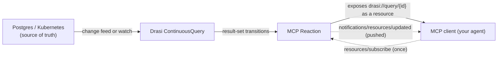
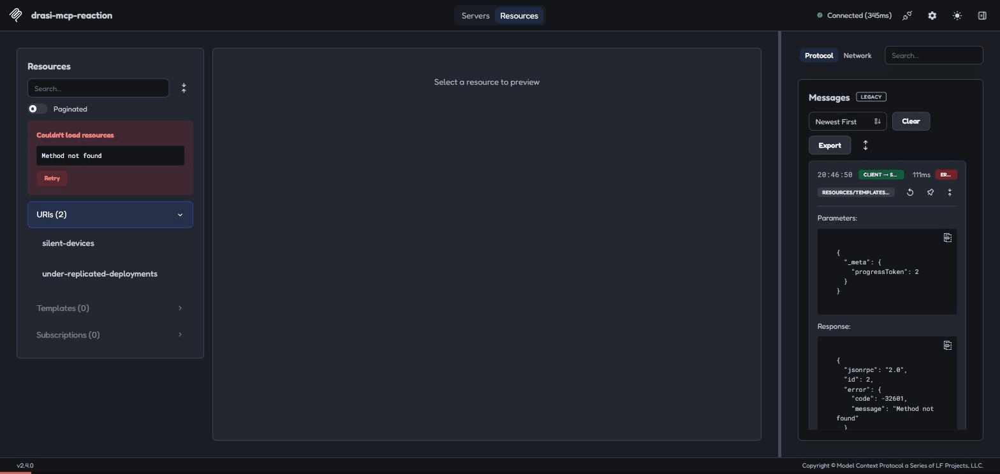

LLM context is a snapshot. Ask an agent "what's the status of order 47?" and it answers from whatever it retrieved minutes ago, because Model Context Protocol solved tool access but not the other half of the problem, knowing when the underlying data has actually changed. MCP resources are usually read-on-demand: the client asks, the server answers, and nothing happens in between unless the client asks again.

Drasi's MCP Reaction closes that gap. It exposes each continuous query as an MCP resource that a client can subscribe to, and the server pushes a notification the moment the result set changes, no polling, no re-fetching on a timer. I wanted to see whether that actually held up with a real client rather than trusting the resource model on paper, so I connected the official MCP Inspector to a live reaction and watched what happened.

<!-- truncate -->

## Resources and subscriptions in ninety seconds

Every Drasi continuous query becomes a resource at `drasi://query/{id}`. A client that subscribes to it starts receiving `notifications/resources/updated` whenever the result set changes, tagged with the operation type (`added`, `updated`, or `deleted`) and a Handlebars-formatted payload. Your agent doesn't poll, the data arrives when it changes, and until a client subscribes the server does nothing but track state quietly in the background.



The dotted lines show the model: subscribe once, then the server pushes changes to the client.

## The server YAML, corrected

The nested YAML shape some inventory examples show does not parse against the pinned platform version. `spec.queries.<query-id>` has to be a JSON string, the same convention SyncVectorStore uses for its own per-query config, not a nested map with `description:` and `added:` as literal YAML keys. Get the shape wrong and it fails fast, before the reaction pod even starts, with `400 Bad Request: Json deserialize error: invalid type: map, expected a string`.

```yaml
kind: Reaction
apiVersion: v1
name: inventory-mcp
spec:
  kind: MCP
  queries:
    low-stock-alerts: |
      {
        "description": "Products below reorder threshold",
        "added": {
          "template": "{ \"productId\": \"{{after.productId}}\", \"alert\": \"{{after.productName}} is below reorder level\" }"
        },
        "updated": {
          "template": "{ \"productId\": \"{{after.productId}}\", \"stockChanged\": \"{{before.stock}} -> {{after.stock}}\" }"
        },
        "deleted": {
          "template": "{ \"productId\": \"{{before.productId}}\", \"alert\": \"back in stock\" }"
        }
      }
```

The `template` value is a JSON string nested inside the outer JSON string, so its quotes need escaping. If one level is wrong, the error message does not identify the broken layer. Build the queries one at a time.

The `before`/`after` template context here is the same model as EventGrid reaction templates, learn it once and it carries across every Drasi reaction that uses templates.

## Tested with MCP Inspector

I ran the official [MCP Inspector](https://github.com/modelcontextprotocol/inspector) against a port-forwarded reaction, connected as `streamable-http` (the endpoint is the bare root `/`, not `/mcp`, worth probing before you assume a path), and subscribed to a query watching a Kubernetes deployment that was sitting under-replicated in the cluster.



I then fixed the deployment with a normal `kubectl` update. A `notifications/resources/updated` message arrived at the client unprompted, with no preceding request, and re-reading the resource confirmed the payload had gone from the under-replicated row to empty. The live client received the pushed update without polling.

One small thing to check before you build against this yourself: `resources/templates/list` returns `Method not found`. That's an unimplemented optional capability, not a bug, the reaction only implements `resources/list`, `resources/read`, and `resources/subscribe`.

:::tip A wired subscription is silent until it isn't
A correctly wired subscription is silent until it isn't. After `resources/subscribe` succeeds, you shouldn't see anything at all from the server, no polling traffic, no periodic re-sends of state that hasn't changed, right up until the underlying result set actually changes. The moment it does, exactly one `notifications/resources/updated` should arrive, unprompted, and a `resources/read` straight after should already reflect the new state with no lag. If your client is still issuing `resources/read` calls on a timer after subscribing, the subscription isn't doing its job and you've quietly rebuilt polling on top of a protocol designed to avoid it. And if you subscribe and hear nothing at all even after a real change, check the reaction's own logs first, the "no subscribers, skipping notification" line I mentioned earlier means the server genuinely doesn't think anyone's listening, which usually means the subscription itself never completed.
:::

## The pinned MCP spec and negotiated client version

Drasi's documentation states it pins MCP spec `2025-03-26`, while upstream MCP has since shipped `2025-06-18`, `2025-11-25`, and `2026-07-28` (the last of which introduced an extensions architecture: Tasks, MCP Apps, Skills over MCP). In practice, put auth enforcement at the gateway, don't expect OIDC discovery metadata, and record the exact spec revision pair in your own ADR before you build against it.

One loose end I haven't resolved: the live Inspector session negotiated protocol version `2025-06-18` during `initialize`, not the `2025-03-26` the documentation states. I don't yet know whether that means the documented pin is stale, or whether the reaction simply accepts whatever version a client requests without enforcing its own. Confirm which before you rely on an exact spec-lag number for your own build, and don't take either side's claim as gospel until you've checked it against your own client.

## Two client paths that don't do this today

I checked both the Microsoft Agent Framework SDK and the current Copilot Studio MCP integration. Neither supports resource subscriptions.

Microsoft Agent Framework's built-in MCP support (`MCPStreamableHTTPTool`, `MCPStdioTool`) connects to a server and hands the agent its `functions`. Tools, callable on request. Every code path in the framework that touches an MCP server does the same thing: enumerate the tools, append them to the agent's toolset, call them when the model decides to. There's no `resources/subscribe` API anywhere in the SDK. To wire up the pattern in this post you'd drop past Agent Framework's MCP wrapper entirely, use a lower-level MCP client library to hold the subscription yourself, and feed whatever arrives into the agent's context on your own terms. That's a real, buildable pattern. I just haven't built and tested it yet, and I'm not going to write it up as five minutes of framework support when it isn't.

Copilot Studio's MCP integration is the same story from a different angle. The current documentation describes exactly one connection shape: add an MCP server as a **tool**, configure a transport and auth, and the agent orchestrator calls it. The sample schema even names the operation `InvokeMCP`. Nothing in the current docs mentions resource subscriptions or push notifications. If you want your Copilot Studio agent reacting to a Drasi query changing rather than calling it as a tool, today that means bridging it yourself, an HTTP reaction posting to a Power Automate flow or a custom connector, not something Copilot Studio does for you out of the box.

Neither of those is a knock on Drasi. The MCP Reaction does exactly what it claims, subscribe and get pushed updates, and I proved that above with a real client. The lag is on the client ecosystem side, which still treats MCP as tools first, resources later. Plan around that, because both of these frameworks are built on the tools-only assumption today.

The MCP Events extension is also worth watching. It's still in draft, but it generalises this same idea from resource subscriptions to full event and webhook delivery, and Drasi already has working contributor implementations bridging continuous queries into it. Document today's stable surface honestly and the post ages well regardless of where that extension lands.

Hopefully this gives your Copilot something better to work with than a snapshot from five minutes ago.

## References

- [Drasi documentation](https://drasi.io/)
- [Model Context Protocol specification](https://modelcontextprotocol.io/)
- [MCP Inspector](https://github.com/modelcontextprotocol/inspector)
- [Microsoft Agent Framework](https://github.com/microsoft/agent-framework)
- [Connect your agent to an existing MCP server - Microsoft Copilot Studio](https://learn.microsoft.com/microsoft-copilot-studio/mcp-add-existing-server-to-agent?WT.mc_id=AZ-MVP-5004796)
- [drasi-project/drasi-platform](https://github.com/drasi-project/drasi-platform)
