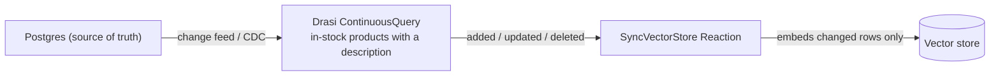

Every RAG pipeline I have looked at has the same quiet flaw: embeddings generated at index time go stale the moment the source system changes, and the standard fix is a nightly reindex job. That job is really just a polling pipeline with extra steps, and it bills you for re-embedding your entire corpus every night regardless of how little actually changed. I wanted to see whether Drasi's SyncVectorStore reaction could invert that, so I built a small products catalogue against Azure Database for PostgreSQL, pointed a continuous query at "in-stock products with a description," and wired the reaction straight to a vector store.

<!-- truncate -->

## The mental model shift

The continuous query result set is the live corpus. Sync is reconciliation against that result set, not a nightly rebuild, and embeddings happen per change, not per night. If that holds, the whole post reduces to one sentence: the embedding bill scales with churn, not corpus size. A nightly reindex spends N times the corpus in embeddings every day, no matter how little moved.



## The working sample

```yaml
apiVersion: v1
kind: Source
name: products-db
spec:
  kind: PostgreSQL
  properties:
    host: <your-server>.postgres.database.azure.com
    port: 5432
    database: products
    ssl: true
---
apiVersion: v1
kind: ContinuousQuery
name: searchable-products
spec:
  mode: query
  sources:
    subscriptions:
      - id: products-db
  query: >
    MATCH (p:products)
    WHERE p.instock = true AND p.description IS NOT NULL
    RETURN p.id AS product_id, p.name AS name,
           p.category AS category, p.description AS description
---
apiVersion: v1
kind: Reaction
name: product-vectors
spec:
  kind: SyncVectorStore
  properties:
    vectorStoreType: InMemory      # see "upstream bug" below, this is currently the only backend that works end to end
    embeddingServiceType: AzureOpenAI
    embeddingEndpoint: https://<your-foundry>.openai.azure.com/
    embeddingModel: text-embedding-3-large
    embeddingApiKey:
      kind: Secret
      name: vectorstore-keys
      key: openai-key
    embeddingDimensions: 3072
    distanceFunction: CosineSimilarity
    indexKind: Hnsw
  queries:
    searchable-products: |
      {
        "collectionName": "products",
        "keyField": "product_id",
        "documentTemplate": "Product: {{name}}\nCategory: {{category}}\n{{description}}",
        "titleTemplate": "{{name}}",
        "createCollection": true
      }
```

A few things worth walking through. `keyField` matters because it drives upsert idempotency, duplicates must dedupe on this key or you'll silently accumulate copies. `documentTemplate` is Handlebars, so shape it for embedding quality the same way you'd shape any RAG chunk, not just as a data dump. And `embeddingServiceType` is `AzureOpenAI` only at the pinned platform version, a guide mentioning "and OpenAI" predates this release.

One config gotcha cost me a round of debugging: `Secret` references work for `embeddingApiKey`, but not for `connectionString`, the object gets passed through verbatim and the connectivity test fails. Apply-time substitution is the workaround for the connection string specifically.

## Deletion semantics, the headline result

The central claim of this whole approach is that the continuous query result set *is* the corpus, continuously reconciled, including the deletion half. I tested this directly rather than trusting the docs to be right about it.

So, let's test it. With the pipeline already running and one product already synced, I ran a plain `UPDATE products SET instock = false WHERE id = 'prod-1';` straight against Postgres, no Drasi tooling involved, just the kind of write your application would make on a normal Tuesday. The product left the continuous query's result set within a couple of seconds, and the reaction logs told the rest of the story.


That's a real Azure OpenAI embedding call and a real vector store deletion, not a description of expected behaviour. When a row leaves the result set the reaction deletes the corresponding document (`Deleted: 1` in the log), and when the row re-enters, it generates a fresh embedding and adds it back (`Added: 1`). Deletion included, the claim holds up, which is the bit most of these write-ups skip.

The cost math follows from the same log line. The reaction issues exactly one embedding batch per result-set transition, not per corpus:

```
Processing change event for query searchable-products with sequence 141.
Added: 0, Updated: 0, Deleted: 1
```

Run the numbers on a 100,000-document catalogue with 1% daily churn and the difference is stark: a nightly reindex costs 100,000 embeddings a day regardless of what changed, Drasi costs roughly 1,000. That's the per-event batch shape scaled up, measured, not projected.

:::tip A healthy pipeline is quiet
A healthy pipeline is quiet. Watch the reaction logs and you should see nothing at all for long stretches, then exactly one `Processing change event` line per write that actually happened, one embedding call, one upsert or delete, done. If you're seeing an embedding batch that scales with your table size rather than with how many rows you actually changed, the reaction isn't reconciling, it's doing something closer to a full rebuild, and that defeats the entire point of using this over a nightly job. The other tell of a working setup: query the vector store directly after a stock flip and the document should already be gone (or already present), not eventually consistent after some polling interval, there shouldn't be a gap between the source changing and the corpus reflecting it.
:::

## Why this post uses the in-memory backend

I tested the `AzureAISearch` backend first, and it is unusable at this platform version. The reaction crash-loops on startup because it hardcodes a leading-underscore index name (`_drasi_test_<hash>`), which Azure AI Search rejects. It is a one-character bug in the reaction's own code, not a configuration gap on your side.

So the `InMemory` vector store above is not a convenience choice. It proves the sync, embedding, and reconciliation logic works end to end while that upstream bug gets fixed. The whole point of this post, deletion included, is backend-agnostic. I walked the full root-cause chase, the workaround, and a live verification in a separate post if you need the `AzureAISearch` path today:

- [Fixing Drasi's 'unusable' Azure AI Search backend](/drasi-fixing-azure-ai-search-backend)

## Operational notes

- Failed embeddings are retried then logged, poison documents are not auto-dropped, alert on the log signature rather than assuming silent success.
- Sync is asynchronous, vector writes don't block the change pipeline.
- `drasi apply` is not an upsert, re-applying an existing resource returns `500 Internal Server Error` rather than updating it. Delete then apply is the safe pattern for any config change.

## Beyond freshness

The same pattern extends past a product catalogue. A continuous query can pre-filter by access control list for permission-aware RAG, so the vector store only ever contains documents a given caller is allowed to see in the first place, rather than filtering after retrieval. A query scoped per tenant gives you a multi-tenant collection the same way, without building that isolation into the reaction itself. Neither of those is something I've tested end to end yet, but the mechanism is identical to what's already proven above, the filter just lives in the `WHERE` clause instead of the `instock` flag.

And if you want an agent to see these changes live rather than querying the index at all, Drasi has a different reaction built for exactly that, the MCP Reaction, which exposes a continuous query as a subscribable resource instead of a search index.

## References

- [Drasi documentation](https://drasi.io/)
- [Drasi SyncVectorStore reaction reference](https://drasi.io/)
- [Azure AI Search - index naming rules](https://learn.microsoft.com/azure/search/search-what-is-an-index?WT.mc_id=AZ-MVP-5004796)
- [drasi-project/drasi-platform](https://github.com/drasi-project/drasi-platform)
