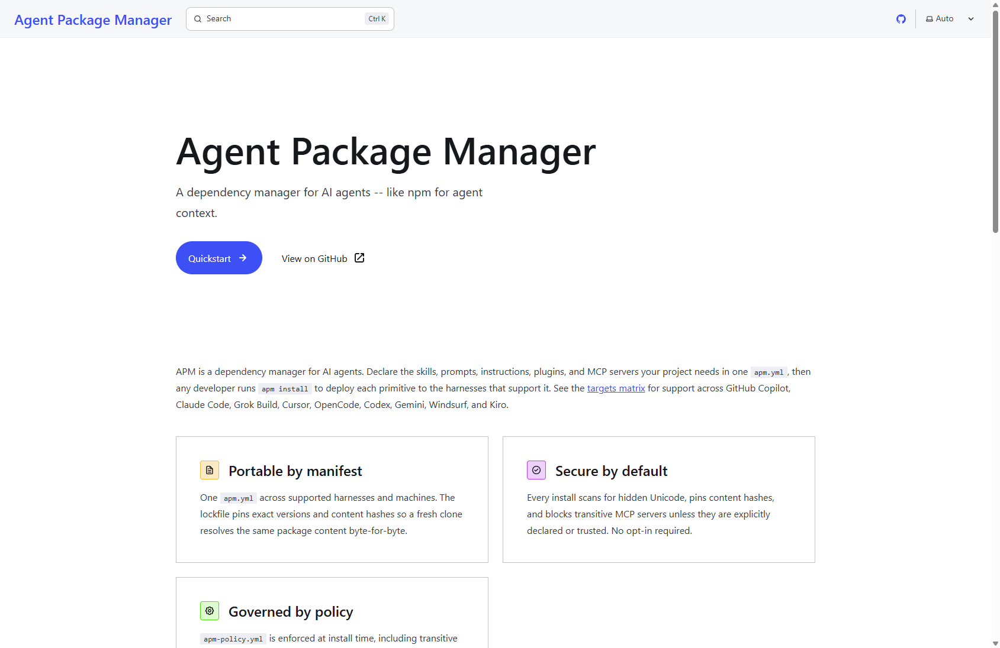
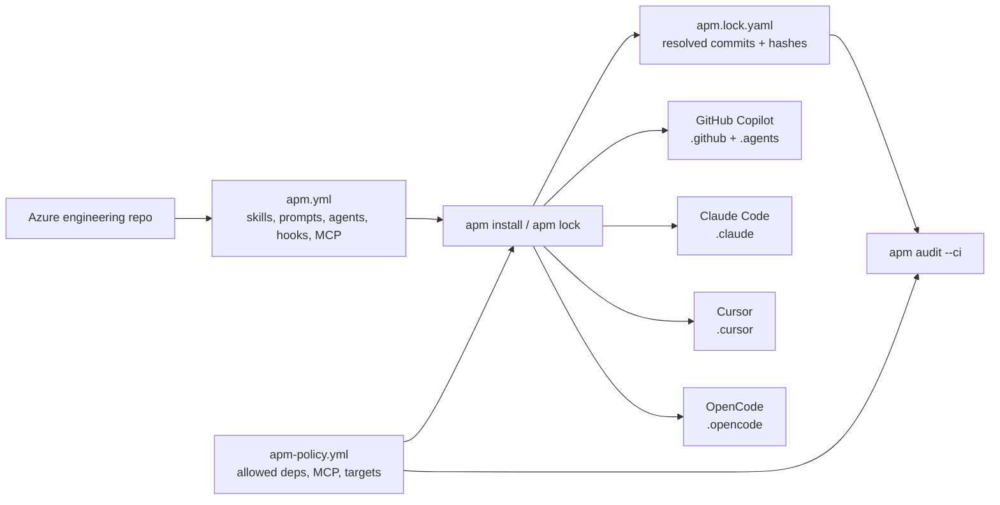
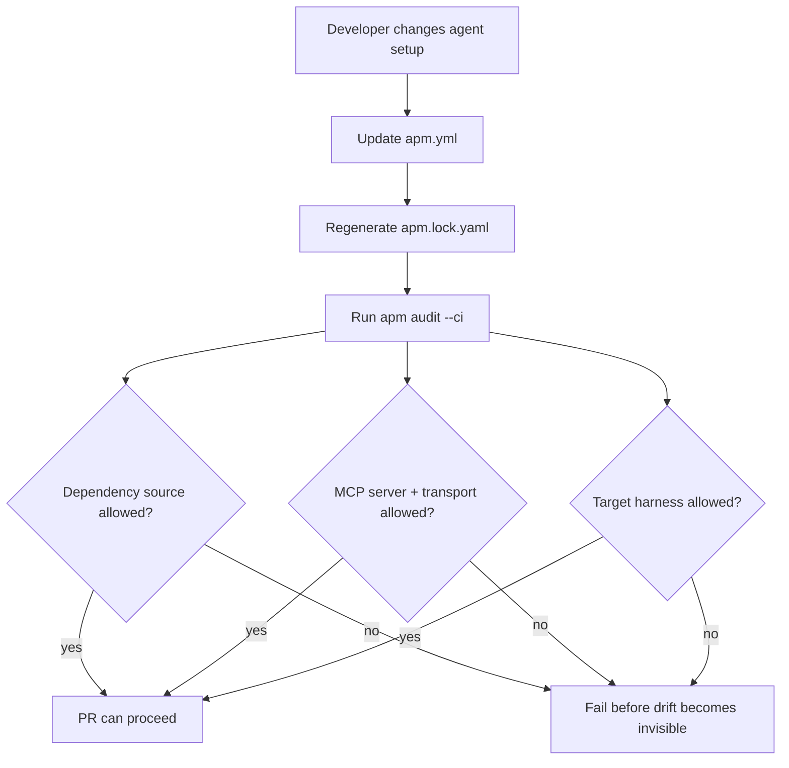

AI coding tools are getting better quickly. The setup around them is still too often a pile of local files, copied prompts, one-off MCP servers, and tribal knowledge.

One developer has custom GitHub Copilot instructions. Another has Claude agents. Someone else has Cursor rules. The platform team wants approved Azure patterns, Microsoft Learn grounding, cost guidance, security checks, and repeatable onboarding.

Six months later, the audit question is simple and uncomfortable:

> What agent context was installed, where did it come from, and who allowed it?

[Agent Package Manager](https://microsoft.github.io/apm/), or APM, addresses that gap.

APM is a dependency manager for AI agents. The official project describes the core model as declaring the skills, prompts, instructions, plugins, and MCP servers a project needs in one `apm.yml`, then running `apm install` to deploy the supported primitives to each agent harness. It also positions the lockfile as the reproducibility artifact, with exact versions and content hashes, and `apm-policy.yml` as the install-time governance control for dependencies, MCP servers, and targets.

Agent configuration needs this kind of mundane, reviewable plumbing.

<!-- truncate -->



## Why this matters for Azure teams

Azure engineering work rarely happens in one tool.

A realistic cloud engineering repo might use:

- GitHub Copilot for day-to-day implementation.
- Claude Code for deep repo work.
- Cursor or OpenCode for local workflows.
- Microsoft Learn MCP for current Azure documentation.
- Azure MCP for cloud resource inspection and operations.
- Foundry MCP for Azure AI Foundry work.
- Context7 for current SDK and framework documentation.
- Team-specific skills for AKS, App Service, Azure Functions, APIM, identity, monitoring, reliability, and cost.

In my `Coding` repo, the manifest now declares the active agent targets explicitly:

```yaml
targets:
  - copilot
  - claude
  - cursor
  - opencode
```

It also declares local primitives and reusable agent-skill packages:

```yaml
dependencies:
  apm:
    - DietrichGebert/ponytail
    - microsoft/skills/.github/plugins/azure-sdk-python
    - microsoft/skills/.github/plugins/azure-sdk-dotnet
    - microsoft/skills/.github/plugins/azure-sdk-typescript
    - microsoft/skills/.github/plugins/azure-sdk-rust
    - microsoft/skills/.github/plugins/microsoft-foundry
    - dotnet/skills
```

The workflow is familiar: declare dependencies, lock the result, and validate it.



## MCP servers are dependencies too

The part I like most is that MCP servers sit in the same dependency story.

That matters because MCP is a tool boundary. If an agent gets access to a server, it gets access to whatever that server exposes. For Azure work, that is powerful and useful, but it should never be invisible.

The repo manifest declares the MCP surface. These are representative entries; the complete manifest is linked in the references.

```yaml
dependencies:
  mcp:
    - name: microsoft.learn.mcp
      registry: false
      transport: http
      url: https://learn.microsoft.com/api/mcp
    - name: context7
      registry: false
      transport: http
      url: https://mcp.context7.com/mcp
    - name: azure
      registry: false
      transport: stdio
      command: npx
      args:
        - -y
        - '@azure/mcp@latest'
        - server
        - start
```

This moves MCP from “whatever is configured on my machine” into the repo contract.

The manifest declares the active targets and approved MCP servers:


## Governance without ceremony

I would not start with a giant enterprise policy.

The smallest useful version is an allowlist:

```yaml
name: Hypervelocity APM baseline
version: 1.0.0
enforcement: block

dependencies:
  allow:
    - DietrichGebert/ponytail
    - dotnet/skills
    - microsoft/skills/**

mcp:
  allow:
    - azure
    - context7
    - foundry-mcp
    - iseplaybook
    - microsoft.learn.mcp
    - microsoft-docs
    - microsoft.mrc.mcp
  transport:
    allow:
      - http
      - sse
      - stdio
  self_defined: allow

compilation:
  target:
    allow:
      - claude
      - copilot
      - cursor
      - opencode
```

The policy allowlists dependency sources, MCP servers and transports, agent targets, and required manifest metadata. It is install-time governance, not a runtime sandbox: it enforces declarations before files are written, while runtime behaviour remains with the agent harness and exposed tools.



## Lockfiles give you the forensic answer

The lockfile is where APM starts to feel familiar.

In this repo, `apm.lock.yaml` records the CLI version, generation time, resolved commits, deployed files, and content hashes. For example:

```yaml
lockfile_version: '1'
generated_at: '2026-08-30T20:20:30.928873+00:00'
apm_version: 0.20.0
dependencies:
- repo_url: DietrichGebert/ponytail
  host: github.com
  resolved_commit: 2ed6c52c9d7e5e56942508591085fd45dea277d3
  package_type: marketplace_plugin
  content_hash: sha256:595855eee726cb344087c38d7a3c29586ce8a0dd9a2e7ad8e8eedc91c8d8c575
- repo_url: dotnet/skills
  host: github.com
  resolved_commit: d68dd70857076a17d4b418649bbcd20a315d59c3
  package_type: marketplace_plugin
  content_hash: sha256:34013ed32b6592ccd762f59215480fa5df94b82d0443b7f5288291ac786978e8
```

That answers “what was active?” more reliably than a screenshot of local settings.

The lockfile records resolved commits and content hashes for review:


## Evidence from the repo

I validated the current setup with APM CLI `0.20.0`.


The useful result:

```text
[*] All primitives validated successfully!
[i] Validated 86 primitives:
[i]   * 11 chatmodes
[i]   * 75 instructions
[i]   * 0 contexts
[i]   * 7 MCP dependencies

[*] All 27 check(s) passed
```

The command used:

```powershell
apm --version
apm compile --validate
apm audit --ci --policy .\apm-policy.yml --no-drift --no-fail-fast
```

The `--no-drift` flag is worth calling out. I used it because this working tree has generated-output drift unrelated to the policy example. That means the evidence proves manifest, lockfile, MCP config, and policy compliance. It does not claim the generated deployed files are fully drift-clean.

That distinction is important. APM can be used in stages:

1. Get the manifest right.
2. Generate and commit the lockfile.
3. Add a small policy.
4. Pass policy checks in CI.
5. Tighten drift enforcement once generated files are clean and reproducible.

This staged rollout avoids making a giant governance programme a prerequisite.

## How I would roll this out for Azure engineering teams

For an Azure platform team, I would keep the first implementation small:

```powershell
apm init
apm install
apm lock
apm audit --ci --policy .\apm-policy.yml
```

Then add a required CI check:

```yaml
- uses: actions/checkout@v4
- uses: microsoft/apm-action@v1
- run: apm audit --ci --no-cache
```

The central platform package would carry approved guidance:

- Azure Well-Architected review prompts.
- AKS architecture and production-readiness skills.
- Azure Functions, App Service, APIM, Container Apps, and IaC skills.
- Azure AI Foundry and Agent Framework skills.
- Security, identity, monitoring, reliability, and cost instructions.

Application repos would keep local context for their own architecture and domain.

The policy should stay focused on the supply-chain boundary:

- allowed package sources
- allowed MCP servers
- allowed transports
- allowed targets
- required manifest fields

Do not encode every engineering preference in policy. That belongs in reviewed skills, instructions, and architecture guidance.

APM does not replace Azure Policy, Defender for Cloud, Entra ID, workload identity, network controls, human review, or runtime permission models. It is package management and CI governance for agent context.

## The practical caveat

The ecosystem is still young.

In my setup, `apm lock --parallel-downloads 0` was the reliable path for generating the lockfile. A full install also surfaced useful rough edges: generated hook path drift, target-specific hook naming warnings, and checkout friction in one package on Windows.

I consider that useful signal, not a reason to ignore the model.

The lesson is the same as every other package ecosystem:

- pin what you can
- audit what you install
- keep generated outputs boring
- fix drift before making drift checks mandatory

## The practical takeaway

Skills that guide AKS deployment, APIM configuration, Application Insights instrumentation, or Azure AI Foundry work should be versioned and reviewable. MCP servers exposing Azure operations should be declared and explicitly allowed. APM provides the manifest, lockfile, and policy checks for that work.

## References

- [APM homepage](https://microsoft.github.io/apm/)
- [APM targets matrix](https://microsoft.github.io/apm/reference/targets-matrix/)
- [APM policy overview](https://microsoft.github.io/apm/enterprise/apm-policy/)
- Evidence: [apm.yml](https://github.com/lukemurraynz/Coding/blob/main/apm.yml), [apm.lock.yaml](https://github.com/lukemurraynz/Coding/blob/main/apm.lock.yaml), and [apm-policy.yml](https://github.com/lukemurraynz/Coding/blob/main/apm-policy.yml)
